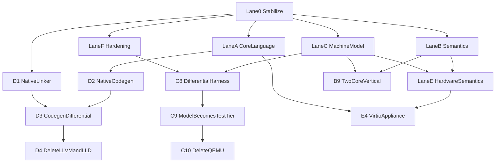

# World-Class Wrela Roadmap (rev 0.2)

Goal: a fully self-contained toolchain: complete core language, real actor/region semantics, a deterministic native machine model (wrela-virt) with UEFI + PCIe ECAM + GICv3/ITS + MSI-X + virtio 1.2, native AArch64 codegen and EFI linking — with LLVM, lld-link, and QEMU used as differential oracles and then deleted once retirement criteria pass.

Excluded permanently: LSP/CST, hosted CI, tutorials/distribution/users, the full multicore runtime, targets beyond the advertised profile, real hardware. In scope per docs/superpowers/specs/2026-07-20-multicore-placement-and-service-slots-design.md: the 2-core static-placement proof vertical (B9) and the sealed service-slot contract (E2) — the spec-side edits from that design (chapters 01/04/10, decision ledger) landed with commit 026abea2.

## Current baseline (2026-07-21, after Lane 0 stabilize)

Lane 0 tasks 0.1–0.5 are complete on branch `drive` / `main` tip `25b55f7c` (plus follow-up commits from this stabilize pass):

- **0.1** Label-migration + hermeticity cleanup committed (`25b43aa6` "fixes"). Argument-label rule from `026abea2` fully migrated across fixtures; pinned evaluator bounds recalibrated (184 steps / 608 bytes; pre-push quota 97); `bind_running_frontend` canonicalizes `env::current_exe()`; clippy/fmt clean.
- **0.2** Hermetic test suite: `/var` symlink class fixed; installation-root policy unchanged. Regression guard is existing `check_cli.rs` doctor tests under default `TMPDIR`.
- **0.3** Git reconciliation: `main` not behind `origin/main`; codex triage note at [docs/codex-branch-triage.md](../../codex-branch-triage.md) with keep/harvest/delete verdicts; Task B5 harvest pointer to `516b0ec5` on `codex/lane-c-bounded-scheduler` / `codex/lane-n-oracle-full-identity`. Delete-verdict branches executed in the Lane 0 stabilize pass (see triage execution record).
- **0.4** Repo hygiene: empty scaffold crate dirs gone (59 real crates); [docs/toolchain-architecture.md](../../toolchain-architecture.md) replaces the former dead README link.
- **0.5** Local nightly gate: `cargo xtask nightly` creates a clean worktree, runs `cargo xgate all`, `cargo xarch`, and native `--full` gates, writes `target/gate-reports/nightly-*.txt`. Optional launchd plist at `toolchain/com.wrela.nightly.plist`. Broken-demo FAIL and HEAD PASS reports exist.

Still out of Lane 0 scope (untouched): `complete` / `worldclass` / `lane-*` worktrees; harvesting `516b0ec5` (Task B5).

Verified previously green: `cargo test --workspace`, `cargo fmt --all -- --check`, `cargo xlint all`, `cargo xarch`. Re-verify with `cargo xtask nightly` after each Lane 0 doc/git change.

## Execution protocol (every task, every agent)

The executing agent must follow this per task. These rules exist because the repo enforces them mechanically.

1. Read the task's cited conformance rows in docs/language/conformance-inventory.md and cited files first.
2. Write a task-level implementation plan to docs/superpowers/plans/ (failing-test-first steps), then implement TDD-style: add the vertical/contract test, watch it fail, implement, watch it pass.

Definition of Done (all required):

- `cargo xgate <owning-slice>` green, plus `cargo test --workspace` green in a clean worktree. Never pass test filters; never add `#[ignore]` to dodge a failure.
- The same change updates the conformance-inventory row(s) with named test evidence (inventory rule: a new obligation adds/splits a row in the same change).
- Unsupported source still fails closed with a stable diagnostic. Deleting a rejection to make a fixture parse is forbidden.
- New crates get entries in docs/crate-contracts.md and pass `cargo xarch`.
- Any new emission path asserts byte-identical output on repeated runs (existing pattern: crates/wrela-compiler/tests/elif_vertical.rs:383).
- One commit per task, message style matching git log.
- If blocked or a task's assumptions are wrong, stop and report; do not improvise around the sealed boundaries.

All `.wr` fixtures must be label-correct (the rule landed in 026abea2): calls to functions with two or more non-receiver parameters must label every argument; calls to unary functions must NOT label the argument; `_`-declared parameters are positional-only. Synthetic HIR fixtures follow the same rule via `CallArgument::name` (`Some(label)` for multi-param, `None` for unary). Getting this wrong produces `semantic-argument-label-required`/`-forbidden` that pre-empts the diagnostic your test actually asserts.

Pinned exact-bound tests must be recalibrated, never loosened. Several tests assert exact comptime-evaluator budgets (`comptime_aggregate_vertical.rs`: 184 steps/608 bytes; `analyzer.rs` `imported_flat_structure_evaluator...`: 184 steps, pre-push quota 97; `comptime_check.rs` calibrates its own bounds via `minimum_admitted_limit`). If a language change shifts evaluation cost, find the new exact boundary (bisect: limit N passes, N−1 fails with the resource message) and update the constants and the expected failure-message strings together. Do not replace exact assertions with `>=`.

Vertical-slice template (used by all Lane A/B/E language tasks): parser (if new syntax) → wrela-sema → wrela-semantic-lower → wrela-flow-lower → wrela-machine-lower → native codegen → new `crates/wrela-compiler/tests/<feature>_vertical.rs` with positive, negative, exact-limit, and cancellation cases → stdlib module additions under `std/wrela-core-0.1/src/` → inventory rows. Model on `runtime_result_vertical.rs`.

## Operating quirks (sandbox + macOS) — read before running anything

Observed while working this repo inside Cursor's sandboxed shell on macOS; these cost real debugging time.

- **Shared sandbox cargo target dir.** Sandboxed commands run with `CARGO_TARGET_DIR=/var/folders/.../cursor-sandbox-cache/<workspace-hash>/cargo-target`, and the persistent shell carries that env var into unsandboxed (`required_permissions: all`) commands too. All runs therefore share one artifact cache regardless of sandbox mode. This is usually fine, but:
  - **Stale binaries with baked-in paths.** xtask bakes `env!("CARGO_MANIFEST_DIR")` at compile time (`workspace_root()` in xtask/src/main.rs). A test binary compiled from another checkout (e.g. a `/tmp` worktree that shared the target dir) will fail with `cannot canonicalize architecture-check root /private/tmp/...` even after that worktree is deleted, and cargo may not rebuild it. Remedy: `touch xtask/src/main.rs` (or `cargo clean -p <crate>`) whenever a test references a path from a checkout that no longer exists. Better: give worktrees their own `CARGO_TARGET_DIR`.
  - **Nondeterministic-looking failures across modes.** A target that "fails sandboxed but passes unsandboxed" (or vice versa) is usually this staleness, not a sandbox restriction. Rebuild before concluding anything.
- **Everything lives under `/var` (a symlink).** macOS's default `TMPDIR` and the sandbox target dir both sit under `/var/folders/...`, and `/var` → `private/var`. The toolchain's security policy rejects symlinked paths. Production code and tests handle this by canonicalizing host-controlled paths first (`fs::canonicalize(std::env::temp_dir())` in every test's `TestDirectory`; `bind_running_frontend` canonicalizes `env::current_exe()`). Any new code that feeds a host path into `LocalToolchainVerifier`/`reject_symlink_components` must canonicalize it first; any new test must canonicalize its temp root. The installation-root symlink rejection itself is intentional policy — do not weaken it.
- **QEMU smoke tests** (`crates/wrela-test-runner/tests/real_qemu_smoke.rs`) are `#[ignore]`d and need system QEMU + EDK2 firmware outside the sandbox allowlist; run them unsandboxed with the real system `PATH`.
- **LLVM backend builds** need Homebrew LLVM 22 at `/opt/homebrew/opt/llvm` (pinned via `[env]` in `.cargo/config.toml`). Plain `cargo test --workspace` does not need it (the `llvm` feature is off by default); `cargo xgate all`/backend gates do.
- **`cargo xfmt` exit codes get eaten by pipelines.** `cargo xfmt` (= `fmt --all -- --check`) signals failure via exit code while printing a diff; piping through `head`/`tail`/`rg` masks it. Check `$?` explicitly or run `cargo fmt --all -- --check` and grep for `Diff in`.
- **Long test binaries abort late.** A stack overflow in one test (e.g. the small-stack bounded-comptime-recursion guard thread) SIGABRTs the whole test binary, so tests listed after it silently never run and the failure list looks shorter than it is. When a suite aborts, fix the abort first, then re-run to see the true failure set.

## Dependency map

Max parallelism after Lane 0: A1–A4, B1/B2/B4, C1 then C2–C6, D1, F1–F4 can all run concurrently (~12 independent workstreams).

## Lane 0 — Stabilize (serial, blocks everything)

- **0.1 Commit the cleanup.** (done) Label-migration + hermeticity fixes committed as `25b43aa6`.
- **0.2 Hermetic test suite.** (done) `/var` class fixed in `bind_running_frontend`; installation-root policy unchanged.
- **0.3 Git reconciliation.** (done in Lane 0 stabilize) Resolve main vs origin; triage note at docs/codex-branch-triage.md; execute delete verdicts; harvest pointer for Task B5 remains `516b0ec5`. AC: main not behind origin; triage note + execution record committed.
- **0.4 Repo hygiene.** (done) Empty scaffold dirs gone; docs/toolchain-architecture.md landed.
- **0.5 Local nightly gate.** (done) `cargo xtask nightly` + optional launchd plist; FAIL and PASS reports under `target/gate-reports/`.

## Lane A — Core language breadth (chapter 02/06/07/10 rows)

Each task uses the vertical-slice template. Inventory rows cited per task.

- **A1 Prelude + general Option/Result.** Rows 2.2.2, 10.2, 10.3. Ambient shadowable prelude (Option, Some, None, Result, Ok, Err, panic) via ordinary name resolution; general `Result[T,E]`/`Option[T]` payload ownership, `?`, unique From. Builds on `std/wrela-core-0.1/src/option.wr`/`panic.wr` (landed in 026abea2). AC: vertical test with generic payloads through native COFF; prelude names resolve without import; explicit-import verticals still pass.
- **A2 for + closed iteration set.** Row 2.7 (ranges, fixed arrays; no user iteration protocol — that is an exclusion). AC: `for_vertical.rs` through machine CFG and native COFF; non-closed iteration targets rejected with a stable diagnostic.
- **A3 Match completeness + tail expressions.** Rows 2.3.3, 2.7, 2.8: guards, wildcards, alternatives, payload bindings, tail-position match/if block expressions, inline if/else expression. Current runtime match is constructor-arms-only (wrela-sema/src/analyzer.rs ~4523–4657 rejections). AC: exhaustiveness diagnostics preserved; vertical covering every new arm form.
- **A4 init constructors.** Row 2.3.2: optional init with partial-initialization tracking and fallible rollback; linear struct obligations. Sema currently rejects at analyzer.rs (initializer "not yet", lines ~1241, 6649, 10479). AC: vertical incl. rollback-on-error case.
- **A6 Generics.** Rows 2.5.3, 2.3.4: type/const params, inference, monomorphization beyond the restricted Result path; generic interfaces with bounds; method-call syntax. This is the largest Lane A task; do before A8. AC: generic struct + generic interface + monomorphized calls through native COFF; no runtime generics (closed-world monomorphization only, row 9.3).
- **A7 Strings/bytes + bounded formatting.** Row 10.10: `String[..N]`, `Bytes[N]`, bounded Format, string interpolation lowering (parser already accepts it). AC: formatting vertical with exact capacity-exceeded diagnostics.
- **A5 deriving(Eq, Format, From).** Rows 2.3.6, 10.14. Depends on A6 (interface machinery) and A7 (Format). AC: unknown deriving name is a build error; From legal only for single payload variant.
- **A8 Collections.** Rows 10.9, 3.10: fixed arrays, `List[T, ..N]`, `SlotMap[T, ..N]` with fresh IDs/generations, `items`/`items_mut` closed iteration. Depends on A6. AC: exhaustion and generation-retirement cases in the vertical.

## Lane B — Differentiating semantics (chapters 03–04; the reason the language exists)

- **B1 Views/projections at runtime.** Rows 3.4.x, 2.3.5: lexical second-class views, projection carriers, implicit conservative provenance, disjointness, no escape/store/await. Parser+model exist; no analysis/runtime. AC: provenance-named diagnostics per spec; vertical through native COFF.
- **B2 Region classes + inference.** Rows 3.6–3.9: image/task-frame/call regions, whole-image inference, reported promotion, bounded allocation errors; wire results into wrela-image-report (feeds F5). AC: promotion appears in the sealed report; forbidden-promotion profile rejects.
- **B3 iso[P] pool brands.** Row 3.5: generative brands, durable/request pools, actor transfer. Depends B2. AC: wrong-pool capacity proof rejected with brand-named diagnostic.
- **B4 Universal with + cleanup graph.** Rows 3.11, 1.5.2: deterministic acyclic cleanup dependencies, abort/exit paths. AC: vertical covering normal + abnormal teardown ordering.
- **B5 Recurring actor runtime.** Rows 4.3–4.4, 4.3.5: non-reentrant turns (unconditional, including across await — design §3), unified wait-graph cycle rejection, typed payloads, exactly-once replies, the AsyncExit/ActorCallError/AdmissionResult taxonomy. Start from the harvested scheduler in 0.3. Requires runtime-object growth (toolchain/targets/aarch64-qemu-virt-uefi/runtime-src/runtime.S currently has no scheduler; coordinate ABI additions with wrela-runtime-abi). Constraint from the placement design (§5.2): the scheduler must be a strictly per-core construct with all admission/ordering/turn semantics stated as per-core facts, so B9 reuses it unchanged on core 1. AC: recurring cross-actor typed call with reply proven under the test tier.
- **B6 General async lowering.** Rows 4.5–4.7: bounded state machines, static tasks, suspension legality, idempotent wake. Depends B5. AC: frame-bound report facts; unbounded recursion rejected.
- **B7 with request(...).** Row 4.12: lineage, cancellation scope, request region, permits, teardown. Depends B4, B6. AC: cancellation quarantines request region; permit backpressure vertical.
- **B8 Supervision.** Rows 7.5–7.8: supervisor events, bounded restart intensity, teardown-then-restart, sibling invalidation. Depends B5. AC: restart vertical with generated teardown observed in the event stream.
- **B9 Two-core static-placement vertical.** The proof (not product) demanded by design §6.2 and inventory row 4.15: a 2-core target variant with the manifest placement table (`@image` build fact, actors default to core 0), two `@app` actors on core 1 and one `@service` on core 0, exactly one cross-core send plus one cross-core awaited call with an iso move, lowered to a compiler-generated bounded SPSC ring with release/acquire ordering sealed inside the generated ring ops (no app-visible atomics), IRQ affinity to the owning core, and per-mailbox admission-order record/replay (design §5.5) verified by replaying the recorded order and asserting identical event streams. Negative fixtures per design §10: an actor placed on two cores, a cross-core view/mut payload, and an ISR bound to a non-owner core are all build errors with stable diagnostics. Depends B3 (iso), B5, B6, and 2-core machine-model support (C5/C1) — oracle it against QEMU `-smp 2` while C8 is alive. AC: the vertical passes on both the machine model and QEMU differentially; replay divergence = test failure; inventory rows 4.15 and 1.8 updated with this as evidence.

## Lane C — The wrela-virt machine model (oracle track, phase 1)

> **SUPERSEDED (2026-07-21) by [`docs/runtime-platform.md`](../../runtime-platform.md).**
> The `wrela-virt` AArch64 interpreter / machine model (C1–C10) is **not
> pursued**. QEMU stays a **temporary differential oracle and is still removed** —
> but validated against the new Wrela VMM and native backend rather than the
> interpreter, and **never bundled** (AArch64 hosts only; cross-arch is not a
> goal). Deterministic execution is provided by two-layer determinism
> (event-sourcing + bounded record/replay at the virtio boundary). Verticals such
> as B9 use QEMU as an oracle during bring-up only. The native-codegen and
> native-linker goals survive in
> [`docs/adr/0001-native-backend.md`](../../adr/0001-native-backend.md).

New crates (names match the deleted scaffolding, now real): wrela-aarch64-decode, wrela-aarch64-interpreter, wrela-machine-memory, wrela-machine-bus, wrela-machine-model, wrela-uefi-pe-loader, wrela-uefi-firmware-model, wrela-gicv3-model, wrela-gicv3-its-model, wrela-pcie-model, wrela-virtio-pci-model, wrela-generic-timer-model, wrela-oracle-profile. Every crate enters docs/crate-contracts.md and the xtask slice inventory.

- **C1 Machine contract first.** Write docs/machine-contract.md (versioned; after C10 this document IS the target) + tests/contracts/machine/v1/ fixtures. Must define: observable equivalence = canonical test-protocol event stream (wrela-test-protocol) + exit code + published report facts, NOT instruction traces or byte-identical images; the pinned device inventory (cortex-a57 base ISA subset, PL011, GICv3+ITS, generic timer, PCIe ECAM, virtio 1.2 CS01 modern PCI transport, virtio-blk); determinism rules (test-controlled interrupt injection timing, deterministic timebase); core topology: 1 core for the advertised profile plus a 2-core variant for the B9 placement vertical, with per-core scheduler state and cross-core SPSC ring memory-ordering semantics pinned per design §5; the target rename at retirement (`aarch64-wrela-virt-uefi`). AC: doc + fixtures + xarch contracts land together.
- **C2 Decode + interpreter.** A64 integer/branch/load-store/system subset that wrela-codegen-llvm/src/ir.rs output actually uses; fail closed on any undecoded instruction (matches house style); no FP/NEON (fail closed). Per-instruction golden fixtures generated by QEMU single-stepping during the differential phase (or derived from ARM's machine-readable ASL). AC: golden suite green; undecoded opcode = structured error naming the encoding.
- **C3 Memory/bus + PL011 + generic timer.** Deterministic timebase; PL011 TX captures the test-protocol byte stream. AC: contract fixtures for MMIO dispatch and timer determinism.
- **C4 UEFI boot surface.** Model the interface the image observes, not EDK2 internals: PE32+ loading, UEFI memory map, the minimal boot services the runtime uses, ExitBootServices semantics, ACPI tables (MADT describing GICv3, MCFG describing ECAM), and deterministic firmware-side PCI BAR assignment during modeled enumeration. AC: a current wrela build `.efi` loads and reaches `wrela_image_entry` under the model.
- **C5 GICv3 distributor/redistributor + SPI delivery.** Interrupt injection API under test control (this is what QEMU can never give us — deterministic, replayable interrupt timing for chapter 04/07 conformance). Include per-core redistributors and SPI routing to a specific core so the 2-core variant (B9) needs no GIC rework — full N-core boot stays out of scope. AC: SPI raised by a device model reaches a masked/unmasked ISR vector on the routed core correctly in fixtures.
- **C6 PCIe ECAM + virtio-pci (virtio 1.2 only).** Config space, capability structures, common/notify/ISR/device regions per CS01; virtio-blk device model; interrupt signaling via INTx→SPI first so the whole interrupt story works before the ITS exists. AC: discovery walk + queue round-trip fixture.
- **C7 GICv3 ITS + MSI-X.** Command queue, device/collection tables, LPI configuration/pending tables, MSI-X table/PBA in the PCI model, end-to-end MSI-X delivery. The hairiest single component; after C5+C6. AC: virtio-blk completion signals via MSI-X→LPI in a deterministic fixture.
- **C8 Differential harness + corpus.** In wrela-oracle-profile: run the same `.efi` under the machine model and under system QEMU (pinned virt-10.0/cortex-a57, existing resolution in wrela-toolchain/src/lib.rs:92–137); compare canonical event streams; drive with the F1 fuzzers; freeze every passing behavior as checked-in fixtures (the oracle's value persists as ordinary local tests after deletion). AC: harness runs the full existing example corpus with zero divergence; corpus fixtures committed.
- **C9 Model becomes the test tier.** `wrela test` image tier runs hermetically on the machine model by default (no `#[ignore]`, no system QEMU/EDK2/Homebrew paths); QEMU demoted to the differential lane inside `cargo xtask nightly`. AC: full image-test suite green with QEMU uninstalled.
- **C10 QEMU retirement (delete the oracle).** Gate on explicit criteria: N (default 14) consecutive nightly differential runs with zero divergence over the full frozen corpus including interrupt/MSI-X/cancellation paths, every Lane E vertical passing on the model, and — if B9 has landed by then — the 2-core placement vertical passing differentially against QEMU `-smp 2` (if B9 has not landed, its later development loses the external oracle; prefer landing B9 first). Then: remove QEMU/firmware resolution from wrela-toolchain, rename the target to `aarch64-wrela-virt-uefi`, promote docs/machine-contract.md to the normative platform reference (replacing the QEMU virt pin in docs/language/README.md), update the exclusion ledger. Keep the harness code compiled-but-inert and the frozen corpus — the binaries go, the ability to resurrect stays. AC: `cargo xgate all` + nightly green on a machine with no QEMU installed; grep proves no runtime QEMU references remain.

## Lane D — Native backend (oracle track, phase 2)

- **D1 Native EFI linker (replace lld-link).** Start immediately — small and independent. New COFF-reader/PE32+-writer implementing exactly the policy wrela-link-efi already encodes (`/base:0`, subsystem efi_application, entry `wrela_image_entry`, no default libs); reuse the ~3k-line wrela-link-efi/src/inspect.rs domain knowledge. AC: inspector-clean output; linked image boots under the machine model with an event stream identical to the lld-link-linked image across the corpus; byte-determinism on repeat links.
- **D2 Native AArch64 codegen (wrela-codegen-aarch64).** Direct MachineWir → A64 emission, AAPCS64 subset, reserve-x18, checked-op lowering with identical semantics to the LLVM lane (the FlowWir optimizer stays where it is; naive codegen is semantically sufficient because the spec forbids UB-exploiting optimization, row 9.7). Deliberately deferred until Lane A is substantially done so the churning surface isn't implemented twice. AC: every instruction emitted is decodable by C2 (co-evolve; C2 fail-closed makes drift loud).
- **D3 Codegen differential lane.** Same MachineWir through both backends, both linked by D1, both run under the machine model; assert event-stream equality per corpus case; fuzz-driven like C8. AC: zero divergence across frozen corpus + fuzz budget.
- **D4 LLVM + LLD retirement (delete the oracles).** Same criteria pattern as C10 (N clean nightly differential runs). Then: native lane becomes the only backend; remove the bundled-backend/llvm/bundled-lld features and the inkwell/system-LLVM dependency; keep wrela-codegen-llvm's IR-text renderer deleted or archived per triage; frozen differential corpus stays as tests. AC: full build from a machine with no LLVM installed; `wrela doctor` and nightly green.

## Lane E — Hardware semantics + the credibility artifact

- **E1 MMIO/DMA execution.** Rows 5.1–5.5: manifest-minted capabilities, typed nonoverlapping MMIO with volatile ordering, DMA transfer vs shared-control memory, pool provenance — executing against C's device models. Depends B3, C5–C6.
- **E2 Queues, receipts, and the service slot contract.** Rows 5.6–5.8, 4.13–4.14, 10.5/10.5.1, 10.11: VirtQueue sealed stdlib contract, reserve-before-evaluation, the single merged `Receipt[P]` state machine (Submitted/Committed/Resolved/Recovery) with `@receipt_handoff`, Untrusted/Validated. Includes the sealed `slot.resolve(take receipt)` contract the placement design defers to implementation planning (§4.2): it (a) parks the caller's reply on the slot, (b) ends the service turn (does not suspend it — non-reentrancy is unconditional), and (c) wires receipt completion to a generated internal turn that fills the slot and resolves the reply, with exactly-once and ownership-conditioned outcomes per chapter 10. Also the head-of-line diagnostic: fires on a deliberately turn-holding service fixture, and its repair text names the slot idiom (design §10). Depends A8 (SlotMap), B3 (IsoPool), B7, E1. AC: the design's §4.1 Storage example compiles and overlaps N in-flight reads under the test tier; HOL diagnostic fixture passes; write its chapter 10 contract stub in the same change.
- **E3 ISR effects + MSI-X wiring.** Rows 5.9–5.12: restricted transitively-checked ISR effect sets, InterruptCell, vector topology incl. MSI-X. Depends C7.
- **E4 The virtio storage appliance.** Make docs/language/examples/virtio-storage.wr (700 lines, currently labeled ASPIRATIONAL) compile, boot, and service block requests with observable cancellation/recovery under the machine model, as a checked-in integration test. This is the single credibility event for the whole project. Depends: A (most), B (most), C9, E1–E3. AC: the file's header stops saying aspirational; nightly runs it.

## Lane F — Local hardening (parallel anytime)

- **F1 Fuzzing.** cargo-fuzz targets: lexer/parser grammar fuzz, FlowWir codec round-trip, MachineWir→image differential fuzz (feeds C8/D3); checked-in corpora; bounded fuzz smoke inside `cargo xtask nightly`. AC: targets build and run under a fixed iteration budget; any found crash becomes a committed regression fixture.
- **F2 Benchmarks.** `cargo xtask bench`: compile-time on std/examples/* + image-size baselines with tolerances, reported by nightly (row 8.9 requires named measured claims; today there is no harness). AC: baseline file committed; regression beyond tolerance fails nightly.
- **F3 Install/enrollment.** `cargo xtask install <prefix>` producing the layout `wrela doctor` verifies (`libexec/wrela/wrela-backend`, `share/wrela/toolchain.toml`, `share/wrela/std`); doctor healthy outside the repo. Also unblocks the enrolled-toolchain image tests. AC: `WRELA_TOOLCHAIN_ROOT=<prefix> wrela doctor` exits healthy.
- **F4 Error-code index.** xtask generator enumerating every stable diagnostic code (`semantic-*`, etc.) into a doc; gate fails if a code lacks an entry. AC: index committed; deliberately unregistered code fails the gate.
- **F5 Image report completion.** Rows 8.3, 8.2.5: complete the machine-readable report schema (memory/actor/async/device facts) and emitted-vs-report reconciliation. Grows naturally with B2/B5/E1. AC: report schema fixtures under tests/contracts/.

## Suggested execution order

1. Lane 0 serially (days).
2. Fan out: A1–A4, B1/B2/B4, C1→C2–C6, D1, F1–F4.
3. Converge: A6→A5/A8, B5→B6/B7/B8, C7→C8→C9, F5.
4. B9 (2-core placement vertical) once B3/B5/B6 and C5 exist — before C10 if possible, so QEMU `-smp 2` oracles it.
5. C10 (delete QEMU) when criteria pass; D2→D3→D4 (delete LLVM/LLD) after Lane A stabilizes.
6. E1–E3 as B/C land; E4 last — it is the definition of done for the whole roadmap.
