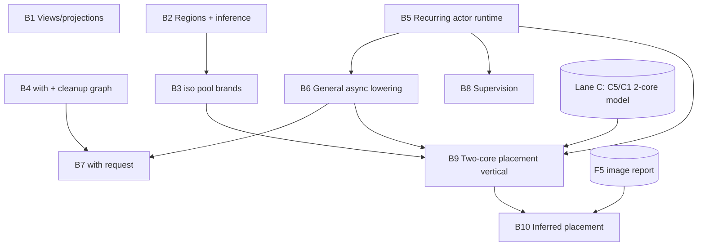

# Lane B execution plan — Differentiating semantics (B1–B9 + inferred placement)

**Owner worktree:** `.claude/worktrees/wrela-roadmap-lane-b-ba6e82` (branch
`claude/wrela-roadmap-lane-b-ba6e82`).
**Parent roadmap:** [`2026-07-20-world-class-roadmap.md`](2026-07-20-world-class-roadmap.md).
**Governing design:** [`../specs/2026-07-20-multicore-placement-and-service-slots-design.md`](../specs/2026-07-20-multicore-placement-and-service-slots-design.md).
**Status of prerequisite:** Lane 0 is landed on `main` (roadmap check-in
`8e3dc3eb`, codex triage `8280290b`, nightly gate + toolchain-architecture doc
`067dd6ef`). Lane B is therefore unblocked.

This document is the master plan for the whole of Lane B. Each task below is a
self-contained brief an executing agent can be pointed at by ID. It restates the
roadmap's execution protocol as hard invariants, records the *current* code
surface for each task (verified 2026-07-21, not copied from the roadmap), fixes
the intra-lane dependency order, and adds one approved scope item beyond the
original roadmap: **B10, inferred placement** (see §"B10").

---

## 0. Ground rules (non-negotiable, every task)

These are the roadmap's execution protocol plus what this campaign adds. An
agent that violates any of these has not completed its task.

1. **No shortcuts, no stubs, no `todo!()`/`unimplemented!()` on any reachable
   path.** "Full production." Unsupported source must still *fail closed* with a
   stable, named diagnostic — deleting a rejection to make a fixture parse is
   forbidden. A task is done when the feature genuinely executes end to end
   through native COFF, not when a happy path compiles.
2. **TDD, failing-test-first.** For each task: (a) write a task-level
   implementation plan to `docs/superpowers/plans/` (this campaign's tasks may
   append to their section here instead of new files); (b) add the vertical /
   contract test; (c) watch it fail; (d) implement; (e) watch it pass.
3. **Definition of Done — all required:**
   - `cargo xgate <owning-slice>` green **and** `cargo test --workspace` green
     in a clean worktree. Never pass test filters; never add `#[ignore]` to
     dodge a failure.
   - The same change updates the cited `docs/language/conformance-inventory.md`
     row(s) with **named test evidence** (a new obligation adds/splits a row in
     the same change).
   - New crates get `docs/crate-contracts.md` entries and pass `cargo xarch`.
   - Any new emission path asserts **byte-identical output on repeated runs**
     (pattern: `crates/wrela-compiler/tests/elif_vertical.rs:383`).
   - One commit per task, message style matching `git log`.
4. **Label rule (landed `026abea2`).** Every `.wr` fixture and synthetic HIR
   fixture must be label-correct: calls to functions with ≥2 non-receiver params
   label every argument; calls to unary functions must NOT label; `_`-declared
   params are positional-only (`CallArgument::name` = `Some(label)` multi /
   `None` unary). Getting this wrong raises
   `semantic-argument-label-required`/`-forbidden` and pre-empts the diagnostic
   the test asserts.
5. **Pinned exact-bound tests are recalibrated, never loosened.** If a change
   shifts comptime-evaluator cost, bisect the new exact boundary (limit N
   passes, N−1 fails with the resource message) and update the constants *and*
   the expected failure-message strings together. Never replace an exact
   assertion with `>=`. Known pins: `comptime_aggregate_vertical.rs` (184
   steps/608 bytes), `analyzer.rs` `imported_flat_structure_evaluator...` (184
   steps, pre-push quota 97), `comptime_check.rs` (`minimum_admitted_limit`).
6. **Do not improvise around sealed boundaries.** If a task's assumptions are
   wrong, or it requires a spec/decision-ledger change, **stop and report** —
   do not weaken a policy to make a test pass. (B10 is the one pre-approved
   spec-touching item; it still lands its ledger edit first.)

### Vertical-slice template (all B language tasks)

parser (if new syntax) → `wrela-sema` → `wrela-semantic-lower` →
`wrela-flow-lower` → `wrela-machine-lower` → native codegen (`wrela-codegen-llvm`
today; `wrela-codegen-aarch64` co-evolves in Lane D) → new
`crates/wrela-compiler/tests/<feature>_vertical.rs` with **positive, negative,
exact-limit, and cancellation** cases → stdlib additions under
`std/wrela-core-0.1/src/` → inventory rows. Model on `runtime_result_vertical.rs`
and (for actor work) the harvested `actor_two_queued_vertical.rs`.

---

## 1. Execution model (how this worktree drives the campaign)

- **All Lane B work happens in this worktree** on `claude/wrela-roadmap-lane-b-ba6e82`.
  One commit per task; the branch is the integration unit for Lane B.
- **Subagents.** Each task is dispatched to a subagent with (a) a pointer to its
  section here, (b) the DoD checklist, (c) the operating-quirks list (§4). The
  agent works the vertical slice and returns a diff + test evidence; the main
  thread verifies DoD, runs the gate in a clean checkout, and commits. Agents do
  **not** commit — the coordinating thread owns commit discipline so the
  one-commit-per-task and message-style rules hold.
- **Per-worktree `CARGO_TARGET_DIR`.** To avoid the stale-baked-path failure
  class (§4), this worktree gets its own target dir; never share the sandbox
  cache across checkouts.
- **Gate before commit.** `cargo xgate <slice>` + `cargo test --workspace` +
  `cargo fmt --all -- --check` (check `$?`, do not pipe) + `cargo xlint all` +
  `cargo xarch`. `cargo xgate all` before any commit that touches emission.

---

## 2. Coordination with Lane A (no dependency, shared surface)

Nothing in Lane A blocks Lane B (roadmap dependency map: `L0` fans to `LA`/`LB`
as siblings; every B task's declared deps are Lane 0, other B tasks, Lane C, or
the 0.3 harvest — never Lane A). The only interaction is **shared-file merge
surface**, resolved at integration, not a blocker:

| Shared file | Lane A writers | Lane B writers | Discipline |
|---|---|---|---|
| `crates/wrela-sema/src/analyzer.rs` | A1–A8 | B1–B9 | Additive functions; avoid reflowing shared match arms; land small, rebase often. |
| `crates/wrela-semantic-lower/src/lib.rs` | A-most | B-most | Same. |
| `docs/language/conformance-inventory.md` | per-task rows | per-task rows | Row-scoped edits; conflicts are mechanical. |
| `std/wrela-core-0.1/src/` | option/result/format | iso/pool/actor/with modules | New files per feature; avoid editing A's module bodies. |

The reverse direction *does* exist and is worth remembering: `E4` and `D2` gate
on Lane A, so Lane A paces convergence — but not B1–B9.

---

## 3. Intra-lane dependency DAG and wave schedule

**Waves (max parallelism within the lane):**
- **Wave 1 (independent):** B1, B2, B4, B5. These share no intra-lane deps and
  can run as concurrent subagents. B5 is the largest — start it first.
- **Wave 2:** B3 (needs B2), B6 (needs B5), B8 (needs B5).
- **Wave 3:** B7 (needs B4 + B6).
- **Wave 4:** B9 (needs B3 + B5 + B6 **and** Lane C's C5/C1). Until C5/C1 land,
  B9's machine-model half oracles against QEMU `-smp 2`; the vertical is not
  *done* until it passes on both differentially.
- **Wave 5:** B10 (needs B9 mechanism + F5 report; spec-ledger edit first).

**Cross-lane watch items:** B5 must coordinate ABI additions with
`wrela-runtime-abi` and grow `toolchain/targets/aarch64-qemu-virt-uefi/runtime-src/runtime.S`
(no scheduler there today). B9 needs Lane C. B10 needs Lane F's F5.

---

## 4. Operating quirks (read before running anything)

- **Own `CARGO_TARGET_DIR` per worktree.** Stale test binaries bake
  `env!("CARGO_MANIFEST_DIR")`; a binary compiled from a since-deleted checkout
  fails with `cannot canonicalize architecture-check root ...` and cargo may not
  rebuild. Remedy if seen: `touch xtask/src/main.rs` or `cargo clean -p <crate>`.
- **`/var` is a symlink** (`/var` → `private/var`); the security policy rejects
  symlinked paths. Any new code feeding a host path into `LocalToolchainVerifier`
  / `reject_symlink_components` must `fs::canonicalize` first; any new test must
  canonicalize its temp root. Installation-root symlink rejection is intentional
  policy — do not weaken it.
- **`cargo xfmt` exit code gets eaten by pipes.** Run `cargo fmt --all -- --check`
  and check `$?` or grep for `Diff in`; never pipe through `head`/`tail`/`rg`
  when you rely on the exit code.
- **Long test binaries abort late.** A stack overflow in one test SIGABRTs the
  whole binary; tests after it silently never run. When a suite aborts, fix the
  abort first, then re-run to see the true failure set. (Relevant to B5/B6 which
  add scheduler/state-machine recursion — the 1.5 MiB guard thread exists for
  this reason.)
- **QEMU smoke tests** (`crates/wrela-test-runner/tests/real_qemu_smoke.rs`) are
  `#[ignore]`d; run unsandboxed with system PATH (needed for B9's `-smp 2`
  oracle).
- **LLVM backend gates** need Homebrew LLVM 22 at `/opt/homebrew/opt/llvm`;
  plain `cargo test --workspace` does not, but `cargo xgate all` / backend gates
  do.

---

## Task B1 — Views/projections at runtime

**Inventory rows:** 3.4–3.4.6, 2.3.5. **Spec:** ch03 §4 (§4.1 ephemeral types,
§4.2 views as projections, §4.3 lexical lifetime, §4.4 what a view cannot do,
§4.5 read/mut projections + projection carrier, §4.6 iteration).
**Deps:** Lane 0 only. **Wave 1.**

**Current state (verified):** `projection` declarations parse
(`parser.rs:2290,2844,3251`); `TypeExpressionKind::View` exists;
`PlaceProjection::{Index,Field}` exists; there are already three view-adjacent
proofs/diagnostics — `ProofKind::ViewDoesNotEscape` (`analyzer.rs:8103`),
`semantic-view-across-await` (`8001`), `semantic-view-escape` (`8606`). What is
missing is the *analysis + runtime*: second-class view lifetime inference,
projection carriers (`Option[view T]`/`Result[view T, E]`), implicit
conservative provenance with **named** provenance diagnostics, disjointness, and
lowering through machine CFG to native COFF. Inventory row 3.4 = "Parsed/modelled
only. gap — req-05".

**Vertical layers:** parser (projection accessor bodies with exactly one active
`yield` on each success path — verify grammar accepts `yield`, add if not) →
`wrela-sema` (lexical lifetime interval per §4.3: begins after init, extends
through every use path, ends at last use / block end, join conservatively
retains; provenance = every receiver+param reachable by the projection body is a
possible backing source; disjointness for `mut view`) → `wrela-semantic-lower`
(projection carrier as a non-storage ephemeral; the one view-leaf rule of §4.5) →
`wrela-flow-lower` → `wrela-machine-lower` → native codegen → vertical test.

**Diagnostics (named, stable):** provenance retention must name **both** the
frozen parameter and the blocking projection (§4.3 example:
`error[access]: `key` is conservatively retained because it is a parameter of
projection `entry``). Reuse `semantic-view-escape` (store/return/capture/send),
`semantic-view-across-await` (live across suspension). Add
`semantic-view-source-mutated` (source mutated while view live),
`semantic-projection-multiple-yields` (more than one active yield),
`semantic-projection-carrier-rebound` (carrier used as ordinary value). Fail
closed on nested/generic/tuple view payloads (already the case at
`analyzer.rs:8759,8929,9097`) until later slices.

**Test cases (`view_projection_vertical.rs`):**
- *positive:* `projection header(read packet) -> view Header` bound and
  consumed; `projection entry(mut self, key) -> Result[mut view Item, MissingKey]`
  with `item.count += 1` read/modify/write; both through native COFF; byte-ident.
- *negative:* store view in a struct field; return view from an `fn`; hold view
  across `await`; mutate source while view live; two active yields; carrier
  rebound as value — each with its named diagnostic.
- *exact-limit:* projection-carrier consumption respects the pinned comptime
  budget where applicable; recalibrate if shifted.
- *cancellation:* view dropped on the abnormal-exit path releases its source
  access (feeds B4/B7); assert the source is accessible after.

**stdlib:** projection carrier support in `std/wrela-core-0.1/src/` as needed
(the `view`-wrapped `Option`/`Result` carrier forms — distinct from A1's general
runtime Option/Result; do not collide with A1's module bodies).

**AC:** provenance-named diagnostics per spec; positive vertical through native
COFF with byte-ident repeat; rows 3.4–3.4.6 + 2.3.5 updated with
`view_projection_vertical.rs` evidence.

---

## Task B2 — Region classes + inference

**Inventory rows:** 3.6–3.9 (image/task-frame/call/request/iso region classes,
whole-image inference, reported promotion/budgets, bounded allocation/capacity
errors). **Spec:** ch03 §6 (region classes), §7 (region inference), §8
(promotion and budgets), §9 (bounded allocation). **Deps:** Lane 0 only.
**Wave 1.**

**Current state:** frame/layout data structures exist; general inference/runtime
absent (rows 3.6–3.9 = gap — req-05/09). Wire results into `wrela-image-report`
(this is what F5 completes and B10 consumes).

**Vertical layers:** `wrela-sema` (region classification: which allocations land
in image vs task-frame vs call region; whole-image inference pass) →
`wrela-semantic-lower`/`wrela-flow-lower` (region assignment carried on
allocations) → `wrela-machine-lower` (call-region reset = one release;
task-frame lifetime) → `wrela-image-report` (**promotion appears in the sealed
report**) → vertical.

**Diagnostics:** bounded-allocation / capacity-exceeded named diagnostics;
forbidden-promotion profile (`@no_promote`) rejects with a named code naming the
promoted allocation and the profile.

**Test cases (`region_inference_vertical.rs`):**
- *positive:* a program whose call-region temporaries reset on one frame release
  (§9 example: "one reset releases the frame"); promotion of a value that must
  outlive its frame appears in the image report facts.
- *negative:* `@no_promote` profile + a value that would promote → named
  rejection; allocation beyond a declared budget → bounded-allocation error.
- *exact-limit:* budget boundary is exact (N ok / N+1 rejected).
- *cancellation:* frame release on abnormal exit still runs exactly once.

**AC:** promotion appears in the sealed `wrela-image-report`; forbidden-promotion
profile rejects; rows 3.6–3.9 updated with named evidence.

---

## Task B3 — `iso[P]` pool brands

**Inventory rows:** 3.5 (generative branded `iso`, durable/request pools, actor
transfer, ownership-conditioned recovery). **Spec:** ch03 §5 (actor boundaries
and `iso`), §6.5 (`iso` and pool regions). **Deps:** B2. **Wave 2.**

**Current state:** `graph.pools` / `graph.brands` data structures exist but are
always empty (`analyzer.rs:9827/9829/16226/16228 = Vec::new()`); no runtime, no
brand generativity. Row 3.5 = gap — req-05/07.

**Vertical layers:** `wrela-sema` (generative brand minting — each `iso[P]`
introduces a fresh brand; durable vs request pool kinds; capacity proofs) →
lower/machine (pool allocation, actor-boundary transfer = move of an `iso`
value) → vertical.

**Diagnostics:** wrong-pool capacity proof rejected with a **brand-named**
diagnostic; using an `iso` from pool A where pool B's brand is required →
brand-mismatch named diagnostic.

**Test cases (`iso_pool_vertical.rs`):**
- *positive:* allocate from a durable pool, transfer an `iso[P]` across an actor
  boundary (move), recover ownership conditionally.
- *negative:* wrong-pool capacity proof; brand mismatch; escape of an `iso`
  outside its pool region — each brand-named.
- *exact-limit:* pool capacity boundary exact.
- *cancellation:* pool region teardown returns the `iso` slot.

**AC:** wrong-pool capacity proof rejected with brand-named diagnostic; transfer
vertical through native COFF; row 3.5 updated with evidence.

---

## Task B4 — Universal `with` + cleanup graph

**Inventory rows:** 3.11, 1.5.2 (deterministic acyclic cleanup dependency graph,
all normal/abnormal teardown paths, abort/exit). **Spec:** ch03 §11
(deterministic teardown and `with`). **Deps:** Lane 0 only. **Wave 1.**

**Current state:** `StatementKind::With { .. }` parses (`analyzer.rs:2734,2807`);
`with`/cleanup rejected as "named-place consumption and its cleanup semantics are
outside this bounded slice" (`analyzer.rs:5259,5282`); no cleanup runtime. Rows
3.11 / 1.5.2 = gap.

**Vertical layers:** `wrela-sema` (build the cleanup dependency graph; prove it
acyclic; order teardown as reverse topological) → `wrela-semantic-lower` /
`wrela-flow-lower` (cleanup edges on normal exit, `return`, abort, and error
propagation paths) → `wrela-machine-lower` (deterministic teardown emission) →
vertical.

**Diagnostics:** cyclic cleanup dependency → named rejection naming the cycle;
a cleanup that could fail without a handler → named rejection.

**Test cases (`with_cleanup_vertical.rs`):**
- *positive:* two `with` bindings with a dependency; assert teardown order is the
  exact reverse-topological order on the **normal** path; observe teardown in the
  event stream.
- *negative:* introduce a cleanup cycle → named rejection.
- *exact-limit:* n/a (structural) — assert byte-ident emission.
- *cancellation/abnormal:* teardown order identical on the abort/error-exit path;
  each cleanup runs exactly once even when the body aborts mid-sequence.

**AC:** vertical covering normal + abnormal teardown ordering, both observed in
the event stream; rows 3.11 + 1.5.2 updated.

---

## Task B5 — Recurring actor runtime

**Inventory rows:** 4.3–4.4, 4.3.5 (non-reentrant turns unconditional including
across `await` per design §3; unified wait-graph cycle rejection; typed
payloads; exactly-once replies; the `AsyncExit`/`ActorCallError`/`AdmissionResult`
taxonomy). **Spec:** ch04 §3 (non-reentrant turns), §3.1 (unified wait-for
graph), §3.3 (observable semantics), §3.4 (failed peers/replies), §3.5 (outcome
taxonomy), §4 (mailbox/turn bounds). **Deps:** Lane 0 only (harvest commit is reference-only — rebuilt fresh).
**Wave 1 (start first — largest task).**

**Current state:** unit-payload one-way actor slices exist
(`actor_flow_vertical.rs`, `actor_one_way_send_vertical.rs`,
`actor_cross_send_vertical.rs` — the last proven end-to-end through native
AArch64 COFF as one `@app`→`@service` unit send). Typed call payloads, replies,
recurrence, and the wait graph are absent (rows 4.3/4.3.2/4.3.5 = gap/partial).
`runtime.S` has **no scheduler** (only `image_exit`/`fatal`/test-emit). The
outcome taxonomy has **no carrier type in any layer** (row 4.3.5).

**Rebuild fresh (decided 2026-07-21).** The harvest commit `516b0ec5` on
`codex/lane-n-oracle-full-identity` ("Implement bounded recurring actor
scheduler", ~2788 insertions across `wrela-machine-wir`,
`wrela-machine-lower/scalar.rs`, `wrela-flow-lower`, `analysis_facts.rs`, and
`actor_two_queued_vertical.rs`) is **reference material only, not a scaffold.**
We rebuild the scheduler from scratch against the spec so it does not inherit
that branch's shape or hidden assumptions. Read it if stuck on a specific
lowering question; do not cherry-pick it. The per-core constraint below is
easier to guarantee in a clean build than to retrofit.

**Design constraint (§5.2):** the scheduler MUST be a **strictly per-core
construct** — all admission/ordering/turn/deadline/cancellation semantics stated
as per-core facts — so B9 reuses it unchanged on core 1. Any global scheduler
state is a defect that fails B9 later.

**ABI coordination:** grow `wrela-runtime-abi` (mailbox/turn records, reply
slots) and `toolchain/.../runtime-src/runtime.S` (the per-core scheduler entry).
Extend the existing failure-class enum (`ActorMailboxFull`/`ActorMailboxMismatch`
already at `runtime-abi` lines ~274) rather than inventing a parallel one.

**Outcome taxonomy (row 4.3.5 — define once, referenced everywhere):** sealed
`AsyncExit[E]`; composing `ActorCallError[E]` (`Exit`/`PeerFailed`/`NotAdmitted`);
ephemeral `AdmissionResult` sharing one `AdmissionError` (from `try send`,
`match`/`is` only, never `?`). No other layer restates the variants.

**Test cases (`recurring_actor_vertical.rs` + port `actor_two_queued_vertical.rs`):**
- *positive:* recurring cross-actor **typed** call with a **reply**, proven under
  the test tier; non-reentrant turn holds across `await` (design §3 — a second
  message does not re-enter the turn); exactly-once reply.
- *negative:* wait-graph cycle (actor A awaits B awaits A) → named rejection;
  driver handler self-wait → named rejection; reply delivered twice → build/exec
  error.
- *exact-limit:* derived finite mailbox/turn bounds are exact; logical-vs-physical
  reporting matches (row 4.4).
- *cancellation:* a turn cancelled mid-flight surfaces `AsyncExit`; admitted
  `take` is irrevocable (the payload does not resurrect).

**AC:** recurring cross-actor typed call with reply proven under the test tier;
scheduler is per-core; rows 4.3, 4.3.2, 4.3.3–4.3.4, 4.3.5, 4.4 updated with
named evidence.

---

## Task B6 — General async lowering

**Inventory rows:** 4.5–4.7 (ahead-of-time bounded async state machines, static
tasks, suspension legality, consuming awaitables, idempotent wake,
mask-arm-recheck park). **Spec:** ch04 §5 (async lowering), §5.1
(recursion/stack sizing), §6 (suspension rules), §7 (completion and park/wake).
**Deps:** B5. **Wave 2.**

**Current state:** `runtime_timeout_vertical.rs` is a bounded slice, **not**
general async (rows 4.5–4.7 = gap). No general state-machine lowering.

**Vertical layers:** `wrela-semantic-lower`/`wrela-flow-lower` (lower each `async
fn` to a bounded, ahead-of-time-sized state machine; frame-bound facts) →
`wrela-machine-lower` (suspension points; park/wake) → `wrela-image-report`
(frame-bound report facts) → vertical.

**Diagnostics:** unbounded async recursion → named rejection (frame/stack bound
exceeded); illegal suspension (e.g. holding an external `mut` across `await`,
already partly enforced by `semantic-view-across-await`) → named rejection;
non-idempotent wake path → structural rejection.

**Test cases (`async_lowering_vertical.rs`):**
- *positive:* an `async fn` with multiple suspension points lowered to a bounded
  state machine; frame-bound facts emitted; wake is idempotent (double-wake =
  one resume).
- *negative:* unbounded async recursion → frame-bound rejection.
- *exact-limit:* the frame/stack bound is exact.
- *cancellation:* suspension-point cancellation runs the mask-arm-recheck park
  correctly and tears down the frame once.

**AC:** frame-bound report facts present; unbounded recursion rejected; rows
4.5–4.7 updated.

---

## Task B7 — `with request(...)`

**Inventory rows:** 4.12–4.12.3 (ambient request lineage carried by every `async
fn` — no signature threading; explicit `request=` override + `@detached` opt-out;
fresh lineage/brand minting; atomic child registration; cancellation cleanup;
permit backpressure; sealed race/select). **Spec:** ch04 §12, §12.1
(cancellation delivery), §12.2 (queue permits/backpressure), §12.3 (race/select).
**Deps:** B4, B6. **Wave 3.**

**Current state:** not implemented (row 4.12 = gap). Depends on B4's cleanup
graph (request region teardown) and B6's async machines (lineage rides the async
frame).

**Vertical layers:** `wrela-sema` (ambient lineage inference — do not thread
through signatures; `request=` override; `@detached`) → lower (request region;
atomic child registration; permit accounting) → machine (cancellation delivery to
the request region; quarantine) → vertical.

**Diagnostics:** cancellation must **quarantine the request region**; permit
exhaustion → backpressure (not error) observable; illegal escape of request
lineage → named rejection.

**Test cases (`with_request_vertical.rs`):**
- *positive:* `with request(...)` scope with two children; cancellation
  quarantines the request region and runs its cleanup graph (B4) exactly once;
  inferred lineage is displayed by tooling (row 4.12 requires the tooling view).
- *negative:* lineage escape → named rejection.
- *exact-limit:* permit count is exact — N in-flight ok, N+1 backpressures.
- *cancellation:* the defining case — cancel mid-flight, assert quarantine +
  teardown ordering.

**AC:** cancellation quarantines the request region; permit-backpressure vertical
passes; rows 4.12–4.12.3 updated.

---

## Task B8 — Supervision

**Inventory rows:** 7.5–7.8 (complete supervision tree, bounded restart
intensity, teardown-then-restart, sibling invalidation, reset outcome precision).
**Spec:** ch07 §5–§8. **Deps:** B5. **Wave 2.**

**Current state:** build models only; runtime absent (rows 7.5–7.8 = gap).

**Vertical layers:** `wrela-sema` (supervision tree structure; bounded restart
intensity budget) → lower/machine (teardown-then-restart sequence; sibling
invalidation on reset) → event stream (restart + teardown observable) → vertical.

**Diagnostics:** restart-intensity budget exceeded → named rejection (bounded,
per §7.6); sibling that observes an invalidated peer → named handling.

**Test cases (`supervision_vertical.rs`):**
- *positive:* an actor fails; supervisor tears it down then restarts it; the
  **generated teardown is observed in the event stream**; sibling invalidation
  fires.
- *negative:* restart storm beyond bounded intensity → named rejection.
- *exact-limit:* restart-intensity boundary exact.
- *cancellation:* reset precision — partial-state recovery leaves no half-torn
  state (row 7.8).

**AC:** restart vertical with generated teardown observed in the event stream;
rows 7.5–7.8 updated.

---

## Task B9 — Two-core static-placement vertical

**Inventory rows:** 4.15, 1.8. **Spec/design:** design §5 (placement), §5.2
(per-core execution), §5.4 (hardware affinity), §5.5 (determinism/replay), §6.2
(the proof), §10 (negative fixtures); ch04 §15. **Deps:** B3 (iso), B5, B6, and
**Lane C's C5/C1** (2-core machine-model support). **Wave 4.**

**Current state:** design semantics documented; 2-core vertical absent (rows
4.15/1.8 = gap/documentation-verified). This is a **proof, not a product** — the
full multicore runtime stays permanently excluded (row 1.8).

**What the vertical must contain (design §6.2):**
- A **2-core target variant** with a manifest placement table (`@image` build
  fact; actors default to core 0).
- Two `@app` actors on core 1, one `@service` on core 0.
- Exactly one cross-core `send` **plus** one cross-core awaited call with an
  `iso` move.
- Lowering to a **compiler-generated bounded SPSC ring** with release/acquire
  ordering **sealed inside the generated ring ops** (no app-visible atomics).
- IRQ affinity to the owning core.
- Per-mailbox **admission-order record/replay** (design §5.5): replay the
  recorded order, assert identical event streams; **replay divergence = test
  failure**.

**Negative fixtures (design §10) — all build errors with stable diagnostics:**
an actor placed on two cores; a cross-core `view`/`mut` payload; an ISR bound to
a non-owner core.

**Oracle:** until C5/C1 land, oracle the machine-model half against QEMU
`-smp 2` (run unsandboxed, real PATH). Done requires passing on **both** the
machine model and QEMU differentially.

**AC:** vertical passes on machine model and QEMU differentially; replay
divergence fails the test; rows 4.15 and 1.8 updated with this as evidence.

---

## Task B10 — Inferred placement (approved scope addition)

**Not in the original roadmap — approved 2026-07-21.** The weakness in the
placement design (its own §9 falsifier: "does any realistic profile need
per-load rebalancing that a manifest edit cannot express?") is that the placement
table is **hand-authored**, not that placement is static. B10 keeps placement
static-at-build-time but makes it **inferred rather than manual**, exactly as
region promotion is inferred-and-reported.

**Deps:** B9 (placement mechanism must exist) + F5 (the image report must itemize
turn costs / mailbox depths / budgets). **Wave 5.**

**Spec-first (mandatory, per ground rule 6):** land a decision-ledger entry and a
ch04 §15 / §8.1 amendment *before* implementation, since this changes how the
placement table is authored. Coordinate as a spec edit (the `026abea2`-style
spec-side change), get sign-off, then implement.

**Mechanism:** a whole-image analysis pass consumes the F5 report's measured
turn-cost and mailbox-depth facts and **proposes** a bin-packed
actor→core placement. The developer accepts the proposal or overrides any actor
with a one-line manifest fact (same footing as `@no_promote`). The proposal and
any override are **reported** in the image report; the run stays statically
placed and replayable. No runtime migration, no work stealing — determinism and
the per-core scheduler property (B9) are preserved.

**Test cases (`inferred_placement_vertical.rs`):**
- *positive:* a 2-core image with no manual placement table; analysis proposes a
  placement; the report shows it; the image builds and runs; B9's replay still
  produces identical event streams under the inferred placement.
- *negative:* a manual override that contradicts a legality constraint (e.g.
  places two cores on one actor) → the B9 named rejection still fires.
- *exact-limit:* the bin-packing is deterministic — identical inputs produce a
  byte-identical proposal (assert repeat-run stability).
- *forward path:* note in the plan (not code) the "learned-from-replay" moonshot
  — the non-LLM learner replays event logs offline and re-bakes an improved
  placement into the next image generation (dynamic *between* images, static
  *within* a run). Out of scope for B10 implementation; recorded as the intended
  evolution.

**AC:** inferred placement proposed from report facts, reported, overridable;
deterministic proposal; B9 replay unchanged; ledger + spec amendment landed in
the same change; new/updated rows cite `inferred_placement_vertical.rs`.

---

## 5. Progress tracking

| Task | Wave | Deps | Status |
|---|---|---|---|
| B1 Views/projections | 1 | L0 | not started |
| B2 Regions + inference | 1 | L0 | not started |
| B4 with + cleanup | 1 | L0 | not started |
| B5 Recurring actor runtime | 1 | L0 (harvest ref-only) | not started |
| B3 iso pool brands | 2 | B2 | not started |
| B6 General async lowering | 2 | B5 | not started |
| B8 Supervision | 2 | B5 | not started |
| B7 with request | 3 | B4, B6 | not started |
| B9 Two-core placement | 4 | B3, B5, B6, C5/C1 | not started |
| B10 Inferred placement | 5 | B9, F5, spec ledger | not started |

Update this table (and the cited inventory rows) as each task lands. One commit
per task; the branch is Lane B's integration unit.
