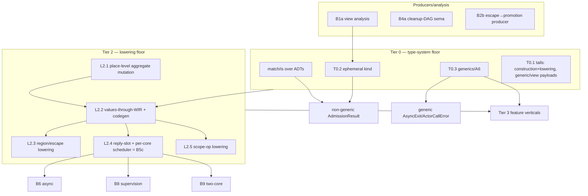

# Remaining Lane A + B work — executable handoff plan

**Audience:** an agent picking this up cold. Everything needed to execute is
here or cited by path. Read §0–§3 fully before touching code.

**Baseline:** `main` @ `9b2fc54d` (this plan's starting point). Companion docs on
`main`, referenced but not required reading:
[unified plan](2026-07-21-unified-toolchain-execution-plan.md) (tier model +
progress table), [Lane B detail](2026-07-21-lane-b-execution-plan.md) (per-task
spec rows + the B1/B2/B4/B5 re-scope evidence), and the parent
[roadmap](2026-07-20-world-class-roadmap.md) (original ACs). This document
**supersedes** their sequencing for the *remaining* A+B work and is the one to
execute against.

**Scope:** Lanes A and B only. Lanes C/D/E/F and the machine model are out of
scope here.

---

## 0. Ground rules (every task, non-negotiable)

1. **No stubs / no `todo!()` / no `unimplemented!()` on any reachable path.**
   Unsupported source must **fail closed with a stable, named diagnostic**.
   Deleting or weakening a rejection to make a fixture pass is forbidden.
2. **TDD, failing-test-first.** Add the test, watch it fail, implement, watch it
   pass. Prefer sema-tier unit tests (see §3 for the harness) for analysis-only
   work; full `crates/wrela-compiler/tests/<feature>_vertical.rs` for anything
   reaching lowering.
3. **Definition of Done (all):** `cargo test --workspace` green in a clean tree;
   `cargo fmt --all -- --check` (check `$?`, never pipe); `cargo xlint all`;
   `cargo xarch`; `cargo xgate <owning-slice>` green. Update the cited
   `docs/language/conformance-inventory.md` row(s) with **named test evidence**
   and **no overclaim** (state precisely what passes and what stays fail-closed).
   One commit per task, message style per `git log`.
4. **Label rule** (landed `026abea2`): `.wr`/HIR fixtures — calls to functions
   with ≥2 non-receiver params label every arg; unary calls must NOT label; `_`
   params are positional-only (`CallArgument::name` = `Some`/`None`). Wrong
   labels raise `semantic-argument-label-required`/`-forbidden` and mask your
   assertion.
5. **Pinned exact-bound tests are recalibrated, never loosened.** If a change
   shifts a comptime-evaluator budget, bisect the new exact boundary (limit N
   passes, N−1 fails with the resource message) and update the constant + the
   expected message together. Never replace an exact assertion with `>=`. Known
   pins: `comptime_aggregate_vertical.rs`, `analyzer.rs`
   `imported_flat_structure_evaluator...`, `comptime_check.rs`
   (`minimum_admitted_limit`).
6. **Stop and report on any sealed-boundary tension** or wrong assumption. Do not
   improvise around a boundary. The correct output of a blocked task is a clean
   tree + a precise report, not a hack.

---

## 1. Operating quirks (read before running anything)

- **Own `CARGO_TARGET_DIR` per worktree.** Set it inside your worktree (e.g.
  `export CARGO_TARGET_DIR=$PWD/.cargo-target`). Otherwise stale test binaries
  bake `env!("CARGO_MANIFEST_DIR")` and fail with `cannot canonicalize
  architecture-check root ...` from a since-deleted checkout; cargo may not
  rebuild. Remedy if seen: `touch xtask/src/main.rs` or `cargo clean -p <crate>`.
- **`/var` is a symlink** (`/var`→`private/var`); the security policy rejects
  symlinked paths. Any new code feeding a host path into `LocalToolchainVerifier`
  / `reject_symlink_components` must `fs::canonicalize` first; any new test must
  canonicalize its temp root. The installation-root symlink rejection is
  intentional — do not weaken it.
- **`cargo xfmt` exit code is eaten by pipes.** Run `cargo fmt --all -- --check`
  and check `$?`, or grep for `Diff in`. Never pipe through `head`/`tail`/`rg`
  when you rely on the exit code.
- **Long test binaries abort late.** A stack overflow in one test SIGABRTs the
  whole binary; tests after it silently never run. Fix the abort first, then
  re-run to see the true failure set. (Relevant to scheduler/state-machine work;
  the 1.5 MiB bounded-recursion guard thread exists for this.)
- **LLVM `--full` gate** needs Homebrew LLVM 22 at `/opt/homebrew/opt/llvm`;
  `cargo test --workspace` does not (the `llvm` feature is off by default), but
  `cargo xgate all` / backend gates do. Sema-tier fail-closed changes provably
  do not affect emission, so per-commit the workspace + `xgate <slice>` suffices;
  run the `--full` gate for milestone proof.
- **QEMU smoke tests** (`crates/wrela-test-runner/tests/real_qemu_smoke.rs`) are
  `#[ignore]`d; run unsandboxed with the real system PATH.

---

## 2. Subagent + integration protocol (learned the hard way — follow exactly)

If you fan work out to subagents:

- **Spawn fresh, worktree-isolated. NEVER resume an agent that reported a clean
  tree.** Its worktree auto-cleans when unchanged, and a resume then writes into
  the *parent* worktree, corrupting it. (This caused one contamination this
  session, caught and recovered.)
- **Stacking on prior commits:** an isolated worktree branches from `main`. To
  build on unmerged work, have the agent `git cherry-pick <hashes>` (the plan-doc
  hunk will conflict as modify/delete — `git rm` it and continue), leave the
  cherry-picks **staged**, and its own work **unstaged**, so `git diff`
  (unstaged) is a clean single-slice delta. Prefer merging finished slices to
  `main` promptly so the stack stays short.
- **Integration (coordinator):** generate the delta patch, then **contamination
  guard** — `grep` the patch for symbols that don't belong to the slice before
  applying. Then `git apply --check`, apply, run the full gate, and commit. One
  commit per slice; agents do not commit.
- **`analyzer.rs` is the shared hot file.** Keep analyzer-touching work
  **serial** (one in flight, integrated before the next) to avoid conflict
  pileups. Independent-crate work (image-report, semantic-lower guards) can
  parallelize.

---

## 3. Current landed state you are building on

### The ADT type-system floor (T0.1, COMPLETE)
`crates/wrela-sema/src/analyzer.rs` — the runtime type subset now resolves real
algebraic data types. Key symbols (re-grep for exact lines; they move):
- `ensure_closed_scalar_enum_type` is now a **thin wrapper** over
  `ensure_closed_scalar_enum_type_resolved`; the wrapper does **cycle
  detection** via a `resolving_enums: Vec<DeclarationId>` field on
  `RuntimeAggregateWork` (push on entry, pop on every return).
- Variant payloads admitted: **unit (0 fields)**, **single scalar** (per-variant
  heterogeneous types), **flat-struct** (via `ensure_flat_structure_type`), and
  **nongeneric closed-enum** (recursive). Layout = one-byte tag + a shared slot
  sized to `max(payload size)` / `max(payload alignment)`; all-unit is tag-only.
- `analyze_closed_enum_constructor` branches unit vs payload via
  `variant_payload_ty` (Option).
- `ensure_core_result_type` is **untouched** — generic `Result` still forces
  `T==E`. Do not conflate the two paths.

### Fail-closed diagnostics already emitted (do not weaken; these mark the deferred tails)
- `semantic-runtime-enum-payload-shape` — variant with ≥2 fields ("at most one").
- `semantic-runtime-enum-payload-type` — generic/view/tuple/array variant payload.
- `semantic-runtime-enum-recursive-payload` — direct/mutual enum-payload cycle.
- `semantic-runtime-enum-unit-construction-pending` — constructing a unit variant
  (fieldless `.name`, routes through unextended DotName validation).
- `semantic-runtime-enum-enum-payload-construction-pending` — constructing an
  enum-payload variant (inner enum-value init not plumbed).
- `semantic-enum-heterogeneous-lowering-pending` /
  `semantic-enum-nominal-payload-lowering-pending`
  (`crates/wrela-semantic-lower/src/lib.rs`, `validate_supported_source_type`) —
  machine lowering of non-uniform / nominal-payload enums.

### Other landed analysis (this session)
- **B5b**: `ProofKind::WaitGraphAcyclic` + `semantic-wait-cycle` +
  `diagnose_driver_handler_waits` (`semantic-driver-handler-waits`). The
  awaited-`ActorRequest` branch in `analyze_wait_graph` currently hard-errors
  `RequestMismatch` (unreachable today) — that is the **B5c integration point**.
- **B2a**: `RegionAssignmentFact` / `PromotionFact` in
  `crates/wrela-image-report` (schema v16 after scheduler ownership and bounded placement-input reporting),
  **producer empty** (that's B2b).

### Known walls (verified this session; cite when scoping)
- Views: `TypeExpressionKind::View` exists; `semantic-view-escape`
  (runtime-type gate, ~`analyzer.rs:8603`), `semantic-view-across-await`,
  `ProofKind::ViewDoesNotEscape`. No view value flows through lowering.
  Projection accessors parse (`parser.rs` `parse_projection_declaration`) but are
  not analyzed.
- Place-level aggregate mutation unimplemented: projected assignment fails at
  ~`analyzer.rs:3997`, mut field projection ~`7730`; `+=` is scalar-locals only.
- Regions: `RegionClass`, `SemanticOperation::{Allocate,ResetRegion,Promote}`
  validated but **never produced**; regions synthesized only for actor
  mailboxes/turn frames. `@no_promote`/`@budget` hard-error
  (`semantic-builtin-attribute-not-implemented`).
- `with`/scope: `ScopeDeclaration`/`StatementKind::With` parse; `ScopeProtocol`/
  `ScopeActivation` modeled but `scope_protocols`/`scope_activations` are
  `Vec::new()`; `With` rejected `semantic-runtime-test-body-not-supported`
  (~`analyzer.rs:2188`). Downstream scope ops validated but never produced.
- Actor reply runtime absent: `ReplyResolve` defined
  (`wrela-flow-wir/src/lib.rs:317`) but never produced; `wrela-machine-wir` has
  no reply slot; `runtime.S` has no scheduler. Outcome-taxonomy types do not
  exist in any layer.

---

## 4. Tier model + dependency DAG (remaining A+B)

**Independence:** `T0.3` (generics) is a large parallel track independent of the
match/views/lowering line. `B2b` and `B4a` are independent sema slices. `L2.x`
lowering is one serial spine after `T0` + `L2.1`.

---

## 5. Task briefs — do these in order unless noted

### GROUP A — testable now, no new infrastructure

#### A-1. General `match`/`is` over ADTs  *(next; unblocks AdmissionResult consumption)*
- **Why:** T0.1 admitted ADT *types* and *construction*; the **consumer** side
  (matching mixed-arity / payload-binding variants, `is`, exhaustiveness over the
  new shapes) needs verifying/extending. `AdmissionResult` is consumed only by
  `match`/`is`, so this is on its critical path.
- **Current:** `analyze_closed_enum_match` (~`analyzer.rs:4714`),
  `analyze_closed_enum_constructor`. Written for uniform single-scalar-payload
  enums. **First step: write tests that match over a unit variant (binds
  nothing), a scalar-payload variant (binds the scalar), a struct-payload
  variant, and an enum-payload variant, plus exhaustiveness/`is`.** Watch which
  fail, then extend.
- **Rows:** 2.3.3, 2.7, 2.8. **DoD** per §0. Keep any unhandled arm shape
  fail-closed with a named diagnostic.

#### A-2. B2b — escape→promotion producer  *(fills B2a's empty producer)*
- **Why:** B2a landed the report schema (`PromotionFact`/`RegionAssignmentFact`);
  nothing produces the facts. Row 3.6–3.9.
- **Scope:** compile one **stateful** actor that stores a value into
  `self.<field>`; run whole-image escape analysis; classify the allocation; emit
  `SemanticOperation::Promote`; widen the `analysis_facts.rs` `supported_projection`
  gate (currently scalar/stateless-actor only, ~`:15-130`) to carry the promotion
  fact into the report. Then give `@no_promote` its real contract (named
  rejection naming allocation + profile), replacing its blanket
  `semantic-builtin-attribute-not-implemented` for that attribute only.
- **Note:** arena/`@budget` (`with arena(...)`) depends on B4b `with` runtime —
  defer.

#### A-3. B4a — `with`/scope cleanup-DAG sema analysis  *(redo fresh; free-call form only)*
- **Why:** first attempt was discarded in an isolation recovery. Rows 3.11, 1.5.2.
- **Scope (free-call scopes only — avoids the receiver/method-resolution
  subsystem):** positive fixture `scope irqs_masked() -> Masked:` used as
  `with irqs_masked() as m:`. Add a `DeclarationKind::Scope` arm to
  `analyze_direct_call` (~`analyzer.rs:6850`, beside enum/struct/function);
  admit free-call `With` through the runtime shape gate (~`:2734`) and
  `analyze_runtime_body`, recursing the body like `If`/`While`. Populate
  `ScopeProtocol`/`ScopeActivation`, build + prove the cleanup DAG
  (`ProofKind::CleanupAcyclic`, satisfying `validate_partial_structure`
  ~`lib.rs:1286`), cycle → named rejection naming participants; `await`-in-
  abort/exit → named rejection. Receiver-form `with` and lowering stay
  fail-closed (`semantic-with-receiver-scope-pending`,
  `semantic-with-cleanup-lowering-pending`). Sema-tier only; no lowering.

### GROUP B — Tier-0 floor remainder

#### B-1. B1a — view/projection static semantics  *(also the first ephemeral producer → unblocks T0.2)*
- **Rows:** 3.4–3.4.6, 2.3.5. **Spec:** ch03 §4.
- **Scope (analysis tier):** the §4.3 view/place concept in `wrela-sema` —
  implicit conservative provenance, lexical lifetime interval, disjointness.
  Named **negatives + provenance**: reuse `semantic-view-escape` /
  `semantic-view-across-await`; add `semantic-view-source-mutated`,
  `semantic-projection-multiple-yields`, `semantic-projection-carrier-rebound`;
  and the §4.3 retention diagnostic naming **both** the frozen parameter and the
  blocking projection. Positive = projection + view binding + consumption
  *analyzes cleanly* with correct single-yield/provenance/lifetime facts.
  Native-COFF view lowering stays fail-closed (that is B1b, Tier 2).

#### B-2. T0.2 — ephemeral / second-class type kind  *(needs B1a or B5c first)*
- **Why gated:** the `?`-vs-`match`/`is` rule needs a *value* of an ephemeral
  type; the producers are views (B1a) or `try send` (B5c). Do B1a first.
- **Scope:** a type-kind property "ephemeral" with consumption legality
  (binding/`match`/`is` allowed; `?` rejected for `AdmissionResult`; store/return/
  capture/cross-await forbidden — unify with the existing view rules). Retrofit
  `view` to the shared concept. Test the `?`-rejection through a real ephemeral
  producer (views). Spec: ch03 §4.1; ch04 §3.5.

#### B-3. T0.3 — generics + monomorphization (A6)  *(large, multi-session, parallel track)*
- **Rows:** 2.5.3, 2.3.4. **Scope:** type/const params, inference, closed-world
  monomorphization beyond the `Result` special case; generic interfaces with
  bounds; method-call syntax. Lift `AsyncExit[E]`/`ActorCallError[E]` off the
  `Result`-only path. This is the widest single unblocker for Lane A (A5, A8) and
  the generic taxonomy. Decompose it yourself into landable increments (e.g.
  generic struct resolution → generic fn monomorphization → generic interfaces),
  each green, TDD, fail-closed beyond.

#### B-4. T0.1 tails
- Nominal/enum payload **construction** (currently
  `semantic-runtime-enum-*-construction-pending`) and unit-variant DotName
  construction. Generic/view/tuple/array variant payloads
  (`semantic-runtime-enum-payload-type`). Do these opportunistically as their
  producers/consumers need them; each is a named-diagnostic flip to real support.

### GROUP C — Tier 2 lowering floor (serial spine; the "make it executable" track)

Nothing rich lowers to native COFF yet. Model verticals on
`runtime_result_vertical.rs`; assert **byte-identical** emission on repeat
(pattern `elif_vertical.rs:383`).

- **L2.1 — place-level aggregate mutation.** `mut`/`+=`/store on field &
  projected places (`self.field`, `agg.field`), unblocking view-RMW, actor
  state, region escape. Current walls: `analyzer.rs:3997`/`7730`.
- **L2.2 — non-scalar values through WIR + codegen.** Aggregates/views/replies
  represented (or erased) through SemanticWir/FlowWir/MachineWir + codecs + LLVM
  codegen to native COFF. Depends L2.1 + T0. This is where the ADT floor and
  views become *executable*; flip the `*-lowering-pending` guards to real
  lowering here.
- **L2.3 — region/escape lowering.** Emit/lower `Allocate`/`ResetRegion`/
  `Promote`; feeds B2b's facts with real runtime data.
- **L2.4 — reply-slot + per-core scheduler (B5c).** Reply slot in
  `wrela-machine-wir` + ABI records (extend `RuntimeFatalCode`, don't fork) +
  `ReplyResolve` production in semantic/flow-lower + reply-await + `runtime.S`
  per-core scheduler entry. **Per-core only** (design §5.2) so B9 reuses it.
  Wire into the B5b `analyze_wait_graph` awaited-`ActorRequest` integration
  point. Gates B6/B8/B9.
- **L2.5 — scope-op lowering (B4b/c).** Lower `EnterScope`/…/`ExitScope`; flow-
  lower the cleanup DAG on normal then abnormal (`return`/`?`/abort/cancel)
  exit paths, teardown in reverse-topological order, observed via
  `FlowOperation::TestEmit` ordering.

### GROUP D — Tier 3 feature verticals (the roadmap ACs; each composes Groups A–C)

Do per the parent roadmap's ACs (cited rows in
[Lane B detail](2026-07-21-lane-b-execution-plan.md) and the roadmap). Rough
dependency order once the floor supports them:

- **Outcome taxonomy** (B5a): non-generic `AdmissionResult` after A-1 + T0.2;
  generic `AsyncExit[E]`/`ActorCallError[E]` after T0.3.
- **B1b** views→COFF (after L2.1/L2.2). **B2c** arena/`@budget` (after B4b).
- **B3** `iso[P]` pool brands (after B2 region work). **B5c** tail: typed
  cross-actor call+reply proven under the test tier. **B6** async lowering
  (after B5c). **B7** `with request` (after B4 + B6). **B8** supervision (after
  B5c). **B9** two-core placement vertical (after B3/B5c/B6 + Lane C's 2-core
  model; oracle vs QEMU `-smp 2`). **B10** inferred placement (approved
  evolution — **spec-ledger + ch04 §15/§8.1 amendment first**, then propose a
  bin-packed placement from F5 report facts, overridable like `@no_promote`).
- **Lane A verticals:** A1 prelude + general Option/Result; A2 `for` + closed
  iteration; A3 match completeness + tail expressions (extends A-1); A4 `init`
  constructors; A5 `deriving(Eq,Format,From)` (after T0.3 + A7); A7 strings/bytes
  + bounded format; A8 collections (`List`, `SlotMap`, after T0.3).

---

## 6. Recommended execution order

1. **A-1 (match/is over ADTs)** — clean win, consumes the floor, on the
   `AdmissionResult` path.
2. In parallel: **A-2 (B2b)** and **A-3 (B4a)** — independent sema slices;
   **B-3 (T0.3 generics)** as its own long-running track.
3. **B-1 (B1a views)** → **B-2 (T0.2 ephemeral)** → non-generic `AdmissionResult`
   lands (first taxonomy win).
4. **Group C** lowering spine: L2.1 → L2.2 → (L2.3, L2.4/B5c, L2.5). This is the
   big lift; it turns everything above into executable native-COFF verticals.
5. **Group D** feature verticals as their floor pieces land; **E4-adjacent**
   Lane A/B breadth throughout.

## 7. Named refusals introduced this session (register in any F4 error-index)

**Correction (2026-07-22).** This list originally presented every name below as a
`Diagnostic::code`. Three of them are not: they are **lowering refusal tags**,
the `feature` string of an `UnsupportedInput` refusal in `wrela-semantic-lower`.
They never reach `wrela_diagnostics::Diagnostic::code`, they carry a
parenthesised qualifier as part of their stable text, and they belong to a
separate index. Two further names no longer exist in source at all. The two
live namespaces are now enumerated and drift-checked separately by `cargo
xdiag`: [diagnostic codes](../../language/diagnostic-index.md) and
[lowering refusal tags](../../language/refusal-tag-index.md).

### 7.1 Diagnostic codes (`Diagnostic::code`, indexed in `diagnostic-index.md`)
`semantic-runtime-enum-recursive-payload`,
`semantic-driver-handler-waits`,
`semantic-projection-generic-pending`,
`semantic-projection-wrapped-carrier-pending`,
`semantic-projection-body-required`,
`semantic-projection-receiver-call-pending`,
`semantic-projection-source-taken`,
`semantic-projection-await`,
`semantic-projection-multiple-yields`,
`semantic-projection-yield-required`,
`semantic-projection-yield-type`,
`semantic-projection-mutable-source`,
`semantic-projection-body-form-pending`,
`semantic-projection-condition-pending`,
`semantic-projection-yield-source`, and
`semantic-projection-yield-field`. (Plus the message change on
`semantic-runtime-enum-payload-shape`: "exactly one" → "at most one".)

### 7.2 Lowering refusal tags (`UnsupportedInput { feature }`, indexed in `refusal-tag-index.md`)
These are **not** diagnostic codes. Their stable text includes the qualifier:
- `semantic-enum-heterogeneous-lowering-pending (per-variant differing scalar enum payloads)`
- `semantic-enum-nominal-payload-lowering-pending (flat-struct or nongeneric-enum nominal enum payloads)`
- `semantic-projection-lowering-pending (…)` — four distinct qualifiers today
  (`projection protocols`, `projection protocols in actor images`,
  `projection activation outside authenticated context`, and
  `outside generated read-only scalar projection subset`)

### 7.3 Listed here but absent from source (do not register)
`semantic-runtime-enum-unit-construction-pending` and
`semantic-runtime-enum-enum-payload-construction-pending` appear in neither
index because neither string exists anywhere in the workspace. §3's
"fail-closed diagnostics already emitted" bullets naming them are stale; the
unit-variant and enum-payload construction tails are no longer marked by those
names. Re-derive the current name before citing either.

## 8. Progress ledger
Keep the table in
[the unified plan](2026-07-21-unified-toolchain-execution-plan.md) §8 current as
slices land, and update the cited inventory rows in the same commit. One commit
per task; the working branch is the integration unit; fast-forward to `main`
when a coherent group is green.

### 8.1 Execution audit (2026-07-21)

The first execution pass landed A-1 (`69188c6b`) and A-3/B4a (`43d3e279`) and
found four sequencing/model assumptions that cross sealed boundaries. Per §0.6,
none was worked around:

- **A-2/B2b is not an independent sema slice.** Stateful actor installation,
  projected `self.field` assignment, actor-state storage, and FlowWir promotion
  are all absent or explicitly fail closed. B2b now follows local aggregate
  mutation, a real actor-state initialization/storage floor, persistent state
  mutation, and the L2.3 promotion path.
- **B1a needs a lexical provenance model distinct from runtime allocation
  regions.** Existing view/loan records require real `RegionId`s, whose producer
  belongs to L2.3. Placeholder or dangling regions are forbidden. Either add a
  separately sealed lexical provenance fact or explicitly merge the real region
  producer into the slice before implementing it.
- **T0.3 preserves the region-generic surface unchanged.** The source-language
  chapter says surface `region` generic parameters are not in revision 0.1,
  while the parser, HIR, and normative syntax fixture accept them. The first
  increment is type-only generic flat-struct specialization; region substitution
  remains excluded until that normative contradiction is adjudicated.
- **L2.1 is two different storage problems.** Local `agg.field` updates can use
  root-SSA replacement and existing FlowWir `InsertField`. Persistent
  `self.field` updates require an initialized actor-state value/global and cannot
  be represented as local SSA. L2.2 starts with multi-field flat scalar structs;
  reply slots and their ABI remain solely L2.4.

These corrections are reflected in the unified plan's §8 table. They supersede
the “A-2 independent sema slice” and undivided L2.1/L2.2 ordering assumptions in
§4–§6 of this handoff.
