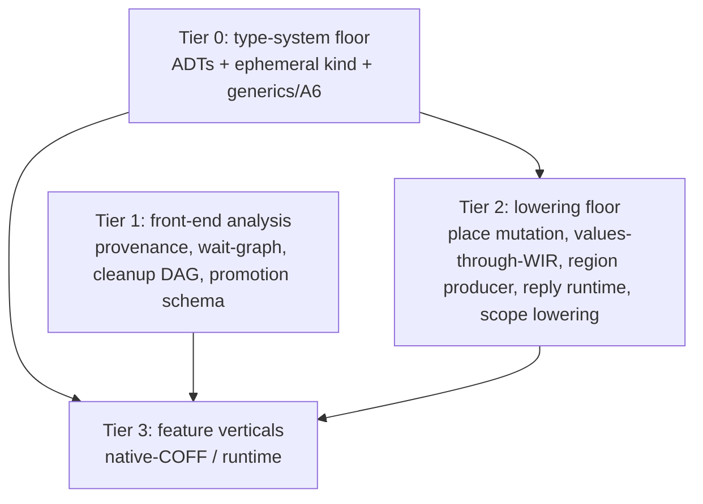

# Unified toolchain execution plan (Lane A + Lane B merged)

**Owner worktree:** `.claude/worktrees/wrela-roadmap-lane-b-ba6e82` (branch
`claude/wrela-roadmap-lane-b-ba6e82`) — now owns the **whole** A+B language +
semantics scope outright (decided 2026-07-21).
**Supersedes:** the "Lane A" vs "Lane B" division in
[`2026-07-20-world-class-roadmap.md`](2026-07-20-world-class-roadmap.md). That
roadmap's task IDs and conformance citations remain valid; only the *lane
grouping and sequencing* are replaced here.
**Detailed B-side briefs + evidence:** kept in
[`2026-07-21-lane-b-execution-plan.md`](2026-07-21-lane-b-execution-plan.md)
(per-task current-state with file:line proof and the B1/B2/B4/B5 re-scopes).
**Ground rules + operating quirks:** §0 and §4 of that Lane B plan apply
verbatim to every task here (no stubs on reachable paths, fail-closed with named
diagnostics, TDD, per-task DoD, label rule, exact-bound recalibration, own
`CARGO_TARGET_DIR`, `xfmt` exit-code trap, late-abort trap). Not repeated here.

---

## 1. Why the lanes merged

Five clean stop-and-report investigations (B1, B2, B4, B5, B5a — no code, no
overclaim) converged on one fact: **the toolchain today only resolves and lowers
scalars and flat aggregates.** Every richer feature in *both* former lanes —
generics, `init`, deriving, collections (was Lane A); views, regions, `iso`,
cleanup, actor replies (was Lane B) — sits behind the *same* missing
infrastructure. "Lane A" and "Lane B" were never separable scopes; they are the
front-ends of one shared build. Verified blocking facts:

- Runtime enum subset admits only `Result[S,S]`-shaped enums: every
  enum-with-args routes to `ensure_core_result_type` (`analyzer.rs:8543`, reject
  `8640`); non-scalar variant payloads rejected (`8927`/`8949`); mixed-arity /
  unit variants rejected (`8892-8901`). No general ADTs.
- No **ephemeral / second-class type kind** exists anywhere (`grep ephemeral`/
  `second_class` → nothing). Views and admission results have no type-kind home.
- No general generics/monomorphization beyond the `Result` special case (A6).
- Views still stop before native lowering. Flat aggregates and the exact
  single-flight `u64` actor reply profile now cross SemanticWir→FlowWir→
  MachineWir→codegen; richer aggregate boundaries and general replies remain
  fail-closed.
- No **place-level aggregate mutation**: `mut`/`+=`/store on a projected or
  field place is unimplemented (`analyzer.rs:3997`/`7730`); `+=` is scalar-locals
  only.
- `Promote` and the bounded free-call scope cleanup subset are now produced and
  authenticated through lowering. General `Allocate`/`ResetRegion` and scope
  abnormal-exit tails remain absent. `runtime.S` has no scheduler; the generated image-entry
  capacity-one two-turn drain tracked under L2.4 is a bounded prerequisite, not
  that runtime scheduler.

---

## 2. The tier model (replaces lane grouping)

Every feature decomposes into slices that land at one of four tiers. A feature is
"done" only when its Tier-3 vertical passes; but most tiers land independently
and green.

- **Tier 0 — Type-system floor (the true base).** Generalize what the compiler
  can *represent*: general ADTs (enums with mixed-arity variants + nominal/
  aggregate payloads), an **ephemeral/second-class type kind**, and generics +
  monomorphization (A6). Gates the widest set — taxonomy, deriving, collections,
  generic containers — and is prerequisite to all lowering of rich values.
- **Tier 1 — Front-end analysis (lands now, parallel, independent of Tier 0).**
  Pure sema/graph/schema slices that introduce **no new runtime value shape**:
  the differentiating diagnostics and reports. This is where Lane B's reason to
  exist actually lives, and it is buildable today.
- **Tier 2 — Lowering floor.** Non-scalar values through the WIR stack + codegen;
  place-level aggregate mutation; the region/escape producer; the reply-slot +
  per-core scheduler runtime; scope-op lowering. Depends on Tier 0 for the value
  shapes it must carry.
- **Tier 3 — Feature verticals.** Each feature's full native-COFF (and, for
  actors/hardware, runtime) vertical, composed from its Tier-1 analysis on top of
  the Tier-0/2 floor. These are the roadmap's original ACs.

Tier 1 does **not** depend on Tier 0 — that is the key scheduling win: the
differentiators land in parallel while the floor is built underneath.

---

## 3. Tier 0 — type-system floor (critical path, build first)

Dependency-ordered. Each is TDD, fail-closed beyond its increment, one commit.

- **T0.1 — General nongeneric ADTs (runtime subset).** Admit enums with
  mixed-arity variants (incl. unit variants) and nominal/aggregate payloads into
  runtime type resolution, replacing the `Result`-only routing at
  `analyzer.rs:8543`. Vertical: define/resolve/`match`/`is` a 3-variant
  mixed-arity enum with a struct payload at the sema tier; lowering stays
  fail-closed with a named `*-lowering-pending` code. **Smallest self-contained
  unblocker** (per B5a: alone makes non-generic `AdmissionResult`/`AdmissionError`
  real). Roadmap tie-in: prerequisite to A3, A5, A8, B5a.
- **T0.2 — Ephemeral / second-class type kind.** Introduce the type-kind with its
  consumption rules (binding/`match`/`is`/`?` legality) and a dedicated
  `?`-rejection path. Unblocks `AdmissionResult` (`match`/`is` only, never `?`)
  and is the home for views (B1) and projection carriers. Depends T0.1.
- **T0.3 — Generics + monomorphization (A6).** Type/const params, inference,
  closed-world monomorphization beyond the `Result` path; generic interfaces with
  bounds; method-call syntax. Largest Tier-0 piece. Roadmap A6. Depends T0.1.

Once T0.1–T0.3 land, **B5a** (outcome taxonomy) becomes landable, as do A5
deriving and A8 collections' type surfaces.

---

## 4. Tier 1 — front-end analysis (in flight now)

These are dispatched or landable immediately; none needs Tier 0.

| Slice | Feature | Status |
|---|---|---|
| B1a | View/projection static semantics (provenance, lexical lifetime, disjointness; named negatives) | **B1a.9 path-exact retention diagnostics landed** — regionless projection activations carry canonical per-path terminal references and exact sorted live-after statement witnesses across straight-line, `if`/`else`, exhaustive enum `match`, and one outer canonical bounded `while` whose post-loop continuation already retains the view; full sealing independently re-derives both. Source-mutation and carrier-rebound preflight now resolve the blocking terminal through that same structured witness, so a conflict in one branch labels that branch's later terminal instead of an unrelated sibling terminal (`branch_local_mutation_names_its_own_blocking_terminal_use`, `branch_local_rebound_names_its_own_blocking_terminal_use`). A loop-held view remains one invariant ephemeral identity rather than acquiring fabricated header/exit SSA values. Empty activations release at initialization, and a bare return kills continuation liveness only on its terminating path (`unused_projection_releases_at_the_end_of_its_initializer`, `branch_local_return_releases_a_view_needed_only_by_the_continuation`, `continuation_anchored_bounded_while_keeps_view_live_exactly`). Loop-local-only uses, nested loops, `with`, `break`/`continue`, receiver/wrapped/generic carriers, and lowering outside B1b's exact generated-test scalar profile remain named fail-closed. |
| B5b | Unified wait-for graph + `wait-cycle`/self-wait diagnostics | **running** |
| B2a | Promotion/region report schema (`PromotionFact`/`RegionAssignmentFact`) | **landed + hardened** |
| B4a | `with`/scope sema analysis: cleanup DAG + `CleanupAcyclic` + cycle diagnostic | **landed**; parameterless/pass-only actor-turn scopes also reach an authenticated real normal-exit Flow cleanup call |
| A2a/b | `for` closed-iteration analysis + literal-range lowering | **literal-range vertical extended** — non-taking half-open and inclusive ranges over two `u64`-representable literals carry exact endpoint/inclusivity/binding/trip-count facts and lower through bounded SemanticWir/FlowWir/MachineWir control flow. Half-open lowering uses `< end`; inclusive lowering uses `<= end` plus an exact post-body equality break before increment, so `u64::MAX ..= u64::MAX` is representable without overflow. The unrepresentable complete-u64-domain trip count fails closed as `semantic-for-inclusive-range-too-large`; descending ranges execute zero body trips using a one-header-check proof floor. Exact bound substitution, operation N/N−1, late cancellation, cold Flow determinism, and repeat native COFF emission are covered (`closed_literal_range_lowers_to_exact_bounded_semantic_loop`, `range_lowering_has_exact_operation_limit_and_late_cancellation`, `literal_ranges_reach_flow_machine_and_deterministic_native_emission`). Dynamic/taking ranges, arrays/containers, outer loop-carried state, suspension, and early loop control remain named fail-closed. |
| A7a-g | Reserved multiline syntax + static literals + bounded interpolation | **extended through authenticated SemanticWir construction** — bool, character, primitive integer, and exact `Static[Str]` parts lower into compiler-minted exact-extent `StaticString`, exact-capacity `BoundedString`, and a source-ordered `FormatBoundedString` operation. Semantic lowering independently rechecks HIR part order/spans, static UTF-8 extent, scalar formatting width, capacity, effects, and result identity (`bounded_integer_interpolation_lowers_to_exact_semantic_parts`, `bounded_character_interpolation_lowers_to_exact_semantic_parts`, `bounded_static_text_interpolation_lowers_to_exact_semantic_parts`); the static-text case pins five operations and 193 aggregate model edges at N/N−1 plus final-poll cancellation. SemanticWir independently rejects order, extent, capacity, value-kind, and result-type forgery (`bounded_string_construction_authenticates_parts_extents_capacity_and_result`). The general `semantic-static-data-consumer-pending` boundary is unchanged and `Static[Bytes[N]]` remains closed before SemanticWir. Runtime allocation/storage, formatting ABI, and native lowering stay named fail-closed at `flow-bounded-string-lowering-pending` (`bounded_string_retains_named_runtime_storage_boundary`). Format specs, floats, broader computed expressions, ISR/async use, explicit contexts, general `Format`, and owned string/bytes operations remain queued. |

Lane A front-ends that are likely Tier 1 (need a surface-verification pass before
dispatch, same as the B tasks got): A2 `for` lowering and remaining closed iterators,
A7 string/format *diagnostics*, A3 match-completeness *analysis*. Each: verify
whether its positive case introduces a new runtime value shape (→ needs Tier 0)
or is pure analysis (→ Tier 1, land now).

---

## 5. Tier 2 — lowering floor

Dependency-ordered; each depends on the Tier-0 value shapes it carries.

- **L2.1 — Place model + place-level aggregate mutation.** `mut`/`+=`/store on
  field & projected places (`self.field`, `agg.field`). Unblocks view-RMW (B1b),
  actor state, region escape. Overlaps the old "Lane A aggregate ownership".
- **L2.2 — Non-scalar values through WIR + codegen.** Aggregates/views/replies
  represented (or erased) through SemanticWir v12 / FlowWir v15 / MachineWir v17 +
  codecs + LLVM codegen, to native COFF. Depends L2.1, T0.
- **L2.3 — Region/escape producer.** Whole-image escape analysis emitting
  `Allocate`/`ResetRegion`/`Promote`; feeds B2a's schema with real facts (B2b).
- **L2.4 — Reply-slot + per-core scheduler runtime (B5c).** Reply-slot in
  machine-wir + ABI + `ReplyResolve` production + reply-await + `runtime.S`
  per-core scheduler. The actor long pole; gates B6/B8/B9. Per-core only
  (design §5.2) so B9 reuses it unchanged.
- **L2.5 — Scope-op lowering (B4b/B4c).** semantic-lower/flow-lower/machine-lower
  the cleanup DAG on normal then abnormal exit paths.

---

## 6. Tier 3 — feature verticals (the roadmap ACs)

Each composes Tier-1 analysis + Tier-0/2 floor into the original roadmap
vertical: B1b (views→COFF), B2b/B2c (promotion, arena), B3 (`iso` pools), B5c
tail (typed call+reply), B6 (async), B7 (`with request`), B8 (supervision),
B9 (two-core placement), B10 (inferred placement); and Lane A's A1/A3/A4/A5/A7/
A8 native verticals. Sequencing follows the roadmap's dependency map, now gated
by Tier-0/2 availability rather than by lane.

---

## 7. Sequencing

1. **Now (parallel):** finish Tier-1 (B1a, B5b, B2a) + dispatch B4a. Integrate
   each into the branch as it lands (reconcile the shared `analyzer.rs` surface —
   the one real merge cost).
2. **Critical path:** build Tier 0 in order T0.1 → T0.2 → T0.3. Start T0.1 once
   the analyzer-touching Tier-1 agents (B1a, B5b) have integrated, to give T0.1 a
   clean base and avoid a 4-way `analyzer.rs` pileup. T0.3 (generics) is the
   largest single effort and is multi-session.
3. **Then Tier 2** in order L2.1 → L2.2 → (L2.3, L2.4, L2.5 in parallel).
4. **Then Tier 3** feature verticals per roadmap deps; B9 oracled against QEMU
   `-smp 2` until Lane C's C5/C1; B10 (inferred placement) last, spec-ledger edit
   first.

**Cross-lane still-external deps unchanged:** B9 needs Lane C (C5/C1); E-lane and
D2 need this scope substantially complete; B10 needs F5.

---

## 8. Progress

| Tier | Slice | Deps | Status |
|---|---|---|---|
| 1 | B2a promotion/region report schema | — | **landed** 3eb2cb69; follow-up sealing requires canonical allocation identities, authenticated dense promotion proofs, and empty producer vectors until B2b is reachable |
| 1 | B5b wait-for graph + diagnostics | — | **landed** 3e216d38 |
| 1 | B1a view/provenance semantics | lexical provenance model | **B1a.8 continuation-anchored bounded-while liveness landed in this slice** — the regionless `LexicalView` authenticates canonical path-terminal references and exact sorted live-after statement IDs across straight-line, `if`/`else`, exhaustive enum `match`, and one outer canonical bounded `while` when a post-loop terminal use supplies the loop fixed point. The loop body is analyzed once with the continuation live, every retained body statement is sealed, and the immutable view value bypasses ordinary loop-carried header/exit SSA synthesis (`continuation_anchored_bounded_while_keeps_view_live_exactly`). Source mutation and carrier rebinding inside that interval are rejected before partial facts are published (`continuation_anchored_loop_keeps_projection_source_frozen`). Backward joins conservatively OR path liveness; unused views release at initialization; a bare return discards successor liveness only on its terminating path (`branch_local_return_releases_a_view_needed_only_by_the_continuation`). Loop-local-only view uses, nested loops, `with`, `break`/`continue`, receiver/wrapped/generic projections, broader consumption, mutation through views, projected-path disjointness, iterator access, and lowering outside B1b's exact generated-test scalar profile remain named fail-closed (`lexical_view_loop_local_nested_and_transfer_tails_fail_closed_by_name`). |
| 1 | B4a cleanup DAG sema analysis | — | **landed** 43d3e279 — free-call scope protocols/calls, lexical activations, reverse-source cleanup DAG + `CleanupAcyclic`, synthetic cycle detector, and named await/receiver/outside-`with` rejections. The bounded normal-path slice lowers parameterless, pass-only actor-turn activations to exact SemanticWir `ScopePlan` records and ordered `EnterScope`/`CommitScope`/`ExitScope` markers, reauthenticates those records at Flow lowering, specializes one `GeneratedCleanup` function per activation, and turns each exit into a real state-carrying Flow call (`free_scope_normal_exit_lowers_exact_semantic_cleanup_sequence`, `nested_free_scopes_preserve_proved_reverse_cleanup_order`, `pass_only_scope_lowers_to_authenticated_normal_cleanup_call`). Abnormal/non-pass tails remain named fail-closed. |
| 0 | **T0.1 general nongeneric ADTs — COMPLETE** | — | **landed** — enum type resolution: unit + mixed-arity + heterogeneous-scalar + flat-struct + nongeneric-enum payloads, tagged-union max-slot layout, structural cycle rejection |
| 0 | · T0.1a unit variants | — | landed ce8385e6 |
| 0 | · T0.1 unit leading-dot construction tail | T0.1a | **landed in this slice** — fieldless `.variant` constructs directly; an argument list stays named fail-closed as `semantic-runtime-enum-unit-constructor-shape` (`runtime_enum_all_unit_type_resolves_and_constructs_leading_dot_variant`, `runtime_unit_variant_argument_list_fails_closed`) |
| 0 | · T0.1b heterogeneous scalar payloads | T0.1a | landed 4b5f125a |
| 0 | · T0.1c flat-struct payloads | T0.1b | landed c509694d |
| 0 | · T0.1d enum payloads + cycle rejection | T0.1c | **analysis complete in this slice** — nested nongeneric closed-enum payload construction is expected-type-directed and exactly sealed (`runtime_enum_enum_payload_construction_analyzes_clean`); recursive payloads remain structurally rejected |
| 0 | T0.1 deferred tails (fail-closed) | T0.1 | one fixed nongeneric flat-structure payload inside the exact two-unary-variant primitive-scalar generic-enum specialization now reaches native construction through MachineWir v17. Heterogeneous payload projection/match, other nominal profiles, nongeneric nominal enum-payload semantic lowering, fixed enum payloads, and generic/view/tuple/array payloads remain named-diagnostic fail-closed. |
| 0 | · T0.3r fixed flat generic-enum payload through FlowWir | T0.3p | **superseded by T0.3u after retaining its Flow evidence** — the exact two-unary-variant profile carries Aggregate/MakeEnum through authenticated FlowWir v15 and canonical codec round-trip; Flow validation rejects tag/payload identity substitution (`fixed_flat_enum_payload_accepts_exact_nominal_operations_and_rejects_substitution`). |
| 0 | · T0.3u fixed flat generic-enum construction through native | T0.3r,L2.2 | **landed in this slice** — MachineWir v17 separates the exact per-tag logical payload types from the physical maximum-size/alignment union slot for one fixed flat primitive-scalar nominal payload plus one distinct primitive scalar. Machine validation rejects nominal, storage, and tag substitution and pins exact N/N−1 validation plus late cancellation (`heterogeneous_enum_authenticates_nominal_payload_storage_and_constructor`). The compiler vertical round-trips FlowWir v15, pins Machine instruction N/N−1, observes late cancellation, and emits repeat byte-identical ARM64 COFF (`fixed_flat_generic_enum_payload_reaches_exact_machine_and_native_coff`). Heterogeneous projection/match and broader nominal profiles remain fail-closed. |
| 0 | · T0.3s generic flat field replacement through native | T0.3q,L2.2 | **landed in this slice** — the exact two-field `Cell[u64]` owned-local replacement profile reaches canonical FlowWir v15, unpacked MachineWir v17, and repeat byte-identical native COFF. `generic_flat_field_update_reaches_flow_machine_and_deterministic_coff` proves field-bound forgery rejection, codec identity, construct/insert/extract identity, exact Flow and Machine instruction N/N−1 ceilings, and late cancellation at both lowerings. Other field counts/type arguments, compound/nested/nonlocal replacement, generic aggregate call boundaries, and runtime generic metadata remain unclaimed or fail closed. |
| 0 | · T0.3t asymmetric core Result | T0.3,A-1,L2.2 | **analysis, SemanticWir, and construction-only native profile landed** — exact public `core.result.Result[T,E]` accepts two distinct primitive stored-copy-scalar arguments. Expected-type-directed `Ok`/`Err`, exhaustive `match`/`is`, and conversion-free owned-rvalue `?` preserve each variant's exact payload type when the enclosing result is the identical specialization. Analysis pins exact value N/N−1, final-poll cancellation, and full-seal Err-type forgery rejection; SemanticWir independently authenticates construction/match/propagation (`asymmetric_core_result_constructs_consumes_and_propagates_exact_payload_types`, `asymmetric_core_result_lowers_exact_payloads_and_question_propagation`). The independently verifiable two-unary distinct-primitive-scalar constructor profile, exercised by core `Result[u8,u64]`, now crosses FlowWir and MachineWir v17 with distinct per-tag logical payload types and an aligned maximum-size union slot. It rejects shape/storage forgery, pins exact MachineWir validation N/N−1 plus late cancellation, and emits repeat-identical native COFF (`asymmetric_core_result_construction_reaches_native_coff`, `heterogeneous_scalar_enum_authenticates_union_storage_and_exact_limits`). This structural boundary avoids treating an unqualified type name as package provenance. Heterogeneous payload projection/binding match and `?` remain named fail-closed at Flow (`flow-enum-heterogeneous-payload-projection-pending`); non-scalar arguments, named-place propagation, error conversion/`From`, and general outcome-taxonomy composition remain unclaimed or fail closed. |
| 0 | T0.2 ephemeral typed-value kind | T0.1 + a **producer** | **landed for authenticated view, AdmissionResult, and bounded AsyncOutcome producers** — `SemanticValueClass::Ephemeral` carries a closed carrier kind/policy. Exact sealers admit real lexical views, exact `core.actor` `AdmissionResult`, and the privileged `Result[u64,AsyncExit[u64]]` produced by one direct fallible non-actor await; producerless/substituted carriers fail sealing. Async outcomes admit only immediate nested `match`/direct `is`; `?` and persistent consumers retain dedicated named boundaries (`async_exit_consumer_tails_fail_closed_by_name`, `ephemeral_consumption_policy_is_closed_per_carrier`). Ownership-conditioned actor-call outcomes remain producer-gated. |

| 0 | T0.3 generics/monomorphization (A6) | T0.1 | **T0.3a–T0.3q plus mixed- and all-unit native enum lowering landed** — flat structures, module-level synchronous functions, concrete synchronous `read self` methods on nongeneric flat structures, and closed enums specialize over ordered primitive stored-copy-scalar type arguments. Generic enum construction is expected-type-directed and its exact specialization survives `match`/`is`; full sealing re-derives arguments, substituted variants, tagged-union layout, and the separate authenticated core `Result` contract. T0.3o admits one fixed nongeneric flat-structure payload beside substituted scalar variants; full sealing re-resolves its exact nominal identity/layout and rejects prefix-valid substitution. T0.3p carries that exact specialization and its nested flat constructor through authenticated SemanticWir Aggregate/ConstructEnum operations, while the SemanticWir validator independently rejects nominal substitution (`generic_enum_fixed_flat_structure_payload_specializes`, `generic_enum_fixed_flat_payload_lowers_to_exact_semantic_enum`, `closed_enum_accepts_exact_flat_structure_payload_and_rejects_nominal_forgery`). T0.3q admits direct plain field replacement on an owned local of the same primitive-scalar generic flat-structure profile through exact analysis and SemanticWir `InsertField`; fresh aggregate identity, full-seal field replay, exact limits, and late cancellation are covered by `generic_flat_structure_field_update_is_exactly_sealed` and `generic_flat_structure_field_update_lowers_to_exact_insert`. Flow retains the stable `flow-enum-nominal-payload-lowering-pending` boundary, fixed enum payloads retain their analysis boundary, and nongeneric nominal payloads retain the semantic-lowering boundary (`flat_structure_enum_payload_stops_at_named_flow_boundary`, `generic_enum_fixed_enum_payload_tail_fails_closed_by_name`, `nongeneric_flat_payload_retains_named_semantic_lowering_boundary`). Earlier scalar-only evidence remains `generic_enum_specializes_copy_scalar_payload_for_construction_match_and_is` and `generic_enum_nominal_payload_tail_fails_closed_by_name`. Function and method inference combine expected results and already-typed explicit arguments, repeat instances deduplicate, signatures substitute exactly, recursive specialization is bounded by an active stack, and full sealing independently derives the specialization key/signature plus the method receiver/target/visibility (`generic_copy_scalar_function_specializes_expected_types`, `generic_function_infers_from_a_typed_argument_without_result_context`, `generic_read_receiver_method_specializes_and_seals_exactly`). An interface requirement and its concrete impl method may declare alpha-equivalent ordered unbounded method-owned type parameters (`concrete_impl_generic_method_specializes`). One exact primitive-copy-scalar specialization of an unbounded type-only generic interface is admitted per nongeneric flat receiver; requirement-owned parameters substitute into direct parameter/result positions before exact impl comparison and direct dispatch (`concrete_generic_interface_specialization_dispatches`, `generic_interface_specialization_tails_fail_closed_by_name`). Unary generic enums with uniform or per-variant heterogeneous copy-scalar specializations and primitive stored-copy-scalar generic flat structures lower through exact actor SemanticWir construction/match/projection operations; heterogeneous enum layout uses the widest payload and match bindings retain each variant's exact type (`heterogeneous_copy_scalar_generic_enum_specialization_lowers_exactly`). Module-level synchronous generic copy-scalar function instances retain exact specialized parameters/results, body returns, instance keys, and direct-call targets in actor SemanticWir; lowering independently authenticates module ownership, ordered unbounded HIR type parameters, concrete scalar arguments, and every signature substitution, while sealing rejects key and target forgery (`generic_copy_scalar_function_specializations_lower_exactly`, `generic_function_lowering_tails_fail_closed_by_name`). Method-owned primitive-scalar specializations on nongeneric flat read receivers lower to exact receiver-first actor SemanticWir calls; same-typed receiver substitution is rejected by the sealer (`concrete_read_receiver_method_call_lowers_to_exact_semantic_call`). T0.3k adds explicit lowering evidence for the concrete impl selected through the admitted one-specialization generic-interface profile: `concrete_generic_interface_dispatch_lowers_to_exact_semantic_call` authenticates receiver-first call order, rejects same-signature target substitution, pins exact SemanticWir operation N/N−1, and observes final-poll cancellation. T0.3l includes method calls in the generated-runtime source reachability graph and takes the L2.2c-compatible zero-explicit-argument reader profile through FlowWir v15, MachineWir v17, and repeat native COFF (`generic_interface_reader_reaches_flow_machine_and_deterministic_coff`). T0.3m admits the same receiver plus one primitive scalar explicit argument when the impl returns that argument unchanged; Machine lowering and LLVM codegen independently reauthenticate receiver-first arity/types and the exact no-computation passthrough body (`generic_interface_argument_reaches_flow_machine_and_deterministic_coff`, `ordinary_two_field_passthrough_is_reauthenticated_and_forgery_fails_closed`). T0.3n admits one exact computed variant: projection of a `u64` receiver field followed by checked unsigned addition with the one explicit `u64` argument. Both native consumers reauthenticate field identity, operand order, failure provenance, result identity, and the complete two-instruction body; operand substitution fails closed (`generic_interface_checked_combine_reaches_flow_machine_and_deterministic_coff`, `ordinary_two_field_checked_combine_is_reauthenticated_and_forgery_fails_closed`). Other Flow/native generic-interface dispatch shapes remain unclaimed. Core `Result` authentication remains distinct. Mixed unit-plus-unary generic enums with one shared primitive payload type now retain explicit payload presence through SemanticWir v12, FlowWir/wire v15, MachineWir v17, and repeat native COFF (`mixed_arity_generic_enum_specialization_lowers_exactly`, `mixed_arity_generic_enum_reaches_exact_flow_machine_and_native_coff`); all-unit generic enums now use an authenticated optional machine payload field, so their exact representation is one tag byte with no payload slot (`all_unit_generic_enum_specialization_lowers_exactly`, `all_unit_generic_enum_reaches_exact_flow_machine_and_native_coff`). Non-type/non-scalar structure, function, method, and interface arguments retain named boundaries. Const/bounded/region parameters, nested nominal/view arguments, fixed enum and argument-bearing/nested nominal generic-enum payloads, unconstrained/conflicting inference, recursion, generic receiver structures and impl targets, multiple generic-interface applications requiring overload selection, native generic field-update execution, async methods, mut/take/temporary receivers, associated calls, generic bounds, Flow/native heterogeneous-enum execution and broader generated-test/native generic proof remain fail-closed or unclaimed. Existing parsed/HIR `region` generics remain unchanged pending the source-spec/normative-fixture reconciliation. |
| — | General `match`/`is` over ADTs (consumer; uses T0.1, needed for AdmissionResult consumption) | T0.1 | **A-1 plus bounded A3 alternatives landed** — mixed-arity/per-variant-type exhaustive statement match; guarded constructor arms, payload `_`, and a final whole-pattern `_` with exact coverage and sealing; unit/payload-wildcard `is`; and `return match` tails. One unguarded arm may join distinct constructors of the exact scrutinee enum; every alternative contributes exact exhaustiveness coverage (`runtime_adt_match_unit_alternatives_contribute_exact_exhaustive_coverage`, `runtime_adt_match_alternatives_share_one_exact_payload_binding`). A payload-free group lowers as a single canonical default after explicit arms cover its exact complement. A payload-bearing group also lowers through one canonical default when every variant exposes the same primitive scalar type and HIR local: one arm parameter, one body, and one Flow/Machine payload extraction preserve SSA without duplication (`one_unit_pattern_alternative_group_lowers_as_exact_complement_default`, `shared_payload_pattern_alternative_lowers_one_canonical_body`). Both forms reach deterministic native COFF (`unit_pattern_alternative_group_reaches_flow_machine_and_deterministic_native_coff`, `shared_payload_pattern_alternative_reaches_flow_machine_and_deterministic_native_coff`). Multiple alternative groups, a source wildcard beside alternatives, guarded fallback overlap, mixed types/shapes, wildcard payloads, and `take` retain named boundaries (`multiple_pattern_alternative_groups_stay_named_fail_closed`, `pattern_alternative_default_composition_tails_fail_closed_by_name`, `runtime_adt_match_alternative_tails_fail_closed_by_name`). General value-producing match expressions, broader alternatives, fixed-array patterns, and success-dominated `is` binding remain absent or named fail-closed. |
| 3 | A5a flat structural derived equality | T0.3,L2.2 | **extended in this slice** — `deriving(Eq)` on a nonempty nongeneric flat structure with primitive stored copy-scalar fields gives `==` and `!=` real borrowed structural semantics. Sema records an ordered authenticated entry for every field's two projections and equality result plus every conjunction result, independently seals deriving/nominal/type/value identity, and leaves both aggregate operands readable. Semantic lowering reauthenticates the source declaration and exact field order, eagerly projects and compares every pair, folds the booleans deterministically with `BitAnd`, and emits one final `BoolNot` for `!=`. Flow/Machine now admit exact boolean `BitAnd`; `multifield_derived_eq_reaches_deterministic_native_coff` proves canonical codec round-trip and repeat byte-identical ARM64 COFF for local multi-field aggregates. `multifield_derived_eq_full_seal_rejects_order_and_fold_forgeries` covers reordered fields and aliased comparison/conjunction authority; adjacent named tests retain missing-deriving, unsupported-shape, exact operation N/N−1, and late-cancellation evidence. A single multi-field enum payload remains correctly rejected for `deriving(From)`. Empty/generic/nested structures, enums, aggregate function boundaries, `Format`, and executable `From` remain fail-closed or unimplemented. |
| 3 | · A5b single-variant scalar `deriving(From)` | T0.3,A5a | **first generated conversion increment landed** — the exact nongeneric enum profile with one variant and one positional primitive stored-copy-scalar field accepts `Destination.from(value)`. Syntax/HIR admit reserved `from` only as an expression member and retain the unary positional label rule. Sema and full sealing authenticate destination type, generated member, variant, payload, result, and source clause; Semantic lowering independently validates them and emits exact `ConstructEnum` (`single_variant_scalar_derived_from_analyzes_and_lowers_exactly`, `derived_from_full_seal_rejects_nominal_variant_payload_and_witness_forgeries`, `derived_from_lowering_has_exact_operation_bound_and_late_cancellation`, `derived_from_adjacent_shapes_and_labels_fail_closed_by_name`). Struct/generic/nested/view/linear/named-field conversion, unique-`From` postfix `?`, hand implementations, `Format`, and Flow/native proof remain fail-closed or absent. |
| 3 | B5a outcome taxonomy | T0.1,T0.2,ADT match/is | **bounded analysis tier landed for AdmissionResult and AsyncExit[u64]** — the existing exact `AdmissionError`/`AdmissionResult` `try send` profile remains. In addition, exact public zero-size cancellation/deadline causes and ordered generic `AsyncExit[E]` are authenticated from `core.actor`; a direct non-actor async helper declared `Result[u64,u64]` is widened only at await to ephemeral `Result[u64,AsyncExit[u64]]`. Immediate exhaustive nested `match` and direct `is` analyze; full sealing independently re-derives core shape, declared/effective type relation, variants, cause identity, and consumer shape. Source construction, `?`, storage/bare consumers, other payloads, `ActorCallError[E]`, runtime delivery, and semantic lowering stay named fail-closed (`fallible_direct_async_await_produces_authenticated_async_exit_for_nested_match`, `async_exit_effective_type_forgeries_fail_full_seal`, `async_exit_analysis_has_exact_type_limit_and_late_cancellation`, `fallible_async_outcome_stops_at_named_semantic_lowering_boundary`). |
| 2 | L2.1a local aggregate mutation | T0 | **landed in this slice** — plain one-level `owned_local.field = rhs` uses exact root-SSA aggregate replacement through SemanticWir v12/FlowWir v15 `InsertField`; the guarded one-field-`u64` representation reaches MachineWir and repeat byte-identical ARM64 COFF (`projected_local_assignment_defines_a_fresh_aggregate_value`, `local_flat_field_update_reaches_deterministic_native_coff`). Compound/nested/nonlocal mutation stays named fail-closed; the separate canonical actor-state exception is tracked in L2.1b. |
| 2 | actor-state initialization/storage floor | L2.1a | **native storage complete** — exactly `value: u64 = 0` synthesizes an actor-owned eight-byte `.state` image region with a dense capacity proof and exact HIR sealing through SemanticWir v12 / FlowWir v15. MachineWir v17 adds a closed `ActorState { actor }` kind, authenticates mailbox→state→turn ordering plus common actor stem/owner/source/proof/layout/zero initialization, and reaches the generic writable-global LLVM path with byte-identical repeat ARM64 COFF (`current_schema_accepts_only_exact_machine_wir_v17`, `canonical_checked_add_actor_state_reaches_native_machine_storage`). Multiple/richer/app state layouts stay fail-closed. |
| 2 | L2.1b persistent actor-state mutation | actor-state storage | **bounded direct access + checked add landed** — an actor turn with `mut self` may directly read the canonical `self.value` cell, perform a plain `self.value = rhs` write, or perform checked `self.value += rhs`. Exact sema access facts bind function/actor/receiver/class/field/region/proof/source; compound access additionally binds distinct authenticated old-state and sum value identities. SemanticWir v12 emits `ActorStateLoad` → checked `Binary(Add)` → `ActorStateStore`; FlowWir/wire v15 retains `AddChecked` between authenticated actor-state address/load/store pairs, and MachineWir v17 retains unsigned `CheckedInteger(Add)` against the existing actor-state global without inventing a receiver address or actor fields. Both lowering and LLVM activation-prefix seals re-authenticate the exact six-instruction u64 chain, and the compiler vertical emits repeat byte-identical ARM64 COFF (`direct_actor_state_read_and_plain_write_are_exact_and_sealed`, `actor_state_checked_add_assignment_analyzes_and_seals`, `actor_state_other_compound_assignments_fail_closed_by_name`, `actor_state_address_uses_appended_tag_and_roundtrips_authority`, `canonical_checked_add_actor_state_reaches_native_machine_storage`). Other compound operators, nested/indexed/multi-field places, and general actor aggregate values remain named fail-closed. |
| 2 | L2.2 values-through-WIR + codegen | L2.1a,T0 | **L2.2a–d landed** — nongeneric flat locals with two or more scalar fields retain an aligned unpacked MachineWir v17 struct with explicit construct/copy/insert/extract operations, exact validation/equality/metering, and LLVM `insertvalue`/`extractvalue` rendering. Typed CFG edges and aggregate PHIs preserve the value across branch joins. Two narrow ordinary synchronous ABI directions are authenticated independently by Machine lowering and LLVM codegen. On input, one owned two-field primitive-scalar receiver enters one of three exact bodies: a scalar-field projection, one scalar argument returned unchanged, or a projected `u64` field checked-added to that argument. On output, one exact two-scalar builder constructs and returns an owned two-field value to a scalar-reading caller. The verticals round-trip FlowWir v15, reject structurally valid extra-computation Flow/Machine forgeries, pin exact Machine instruction N/N−1 ceilings and late cancellation, and emit repeat byte-identical ARM64 COFF (`unpacked_struct_operations_validate_exact_field_types_and_layout`, `two_field_flat_local_reaches_unpacked_machine_wir_and_deterministic_coff`, `two_field_flat_local_crosses_cfg_join_and_emits_deterministically`, `two_field_owned_argument_reaches_scalar_reader_and_deterministic_coff`, `ordinary_two_field_reader_is_reauthenticated_and_forgery_fails_closed`, `generic_interface_argument_reaches_flow_machine_and_deterministic_coff`, `ordinary_two_field_passthrough_is_reauthenticated_and_forgery_fails_closed`, `generic_interface_checked_combine_reaches_flow_machine_and_deterministic_coff`, `ordinary_two_field_checked_combine_is_reauthenticated_and_forgery_fails_closed`, `two_field_owned_result_reaches_caller_and_deterministic_coff`, `ordinary_two_field_builder_is_reauthenticated_and_forgery_fails_closed`). One-field-`u64` erasure remains byte-compatible. Multiple/borrowed/mutable arguments, aggregate results outside the exact builder, non-reader/non-builder bodies, other field counts, nested/non-flat shapes, and broader aggregate function boundaries remain named fail-closed; views and reply shapes beyond the exact L2.4 `u64` profile remain pending. |
| 3 | B1b read-only scalar view execution | B1a,L2.2 | **first native B1b increment landed** — generated synchronous runtime tests admit one exact free/nongeneric/bare immutable projection profile: one read parameter backed by a nongeneric flat copy-scalar aggregate, one direct primitive `yield parameter.field`, one explicit view local, and one straight-line unary terminal read. A bounded lowering context independently authenticates protocol, HIR body, activation, conservative source, terminal use, and exact `ViewDoesNotEscape` authority before erasing the activation to existing SemanticWir `Project`; FlowWir v15 and MachineWir v17 retain one `ExtractField`, the codec round-trips, and repeated ARM64 COFF is byte-identical (`read_only_scalar_view_projection_reaches_semantic_wir`). Field/access/deletion forgeries, exact operation and projection-aware model-edge bounds, late cancellation, reachable-declaration accounting, and the multi-source tail are covered by the adjacent named tests. Mutable, multi-source, receiver/wrapped/generic, deep/non-primitive, actor-image, structured-lifetime, and broader-consumption lowering remain `semantic-projection-lowering-pending`. |
| 2 | L2.3 region/escape runtime lowering | L2.1b,L2.2 | **bounded direct + checked-add promotion landed** — a direct canonical actor-state write and the synthetic checked result of `self.value += rhs` each carry exact `RegionBound` authority as FlowWir/wire v15 `Promote` immediately before their actor-state address/store pair; the RHS is never promoted for the compound write. The mixed vertical reports `alloc:0:actor-state-store` and `alloc:1:actor-state-compound-store`, retains two authenticated Flow markers, rejects RHS substitution, and erases both before an unchanged 14-instruction MachineWir census while retaining the concrete global writes and checked add. `checked_actor_state_result_promotion_is_exact_bounded_and_cancellable` pins SemanticWir ordering, sealing, N/N−1 operations, and late cancellation; `canonical_checked_add_actor_state_reaches_native_machine_storage` emits repeat byte-identical ARM64 COFF. General `Allocate`/`RegionReset`, other region classes/shapes, other compound operators, arenas, pools, budgets, and reset execution remain fail-closed or deferred. |
| 2 | L2.4 reply-slot + scheduler (B5c) | L2.2,T0.1 | **explicit core ownership through MachineWir plus the bounded scheduler prerequisite and first typed reply vertical landed** — FlowWir/model+wire v15 carries one exact scheduler plan for the current single-core profile: core zero owns every dense actor/task ID exactly once and in canonical order. Flow lowering produces it, validation and the codec reject substitution, and Machine lowering reauthenticates and retains it as `MachineSchedulerPlan` for the existing same-core fused profiles. Machine validation independently rejects nonzero-core or incomplete owner sets; the recurring actor vertical pins the plan's exact model-edge N/N−1 boundary (`one_core_scheduler_plan_exactly_partitions_actor_and_task_ownership`, `stateless_actor_projection_preserves_plans_roles_calls_and_proofs`, `async_activation_delivery_roundtrips_canonically`, `machine_consumer_requires_exact_core_zero_scheduler_ownership`, `capacity_one_recurring_chain_drains_two_unit_turns_to_native_coff`). The existing capacity-one startup→first turn→distinct terminal turn profile remains authenticated and deterministic. Separately, one startup task may directly await one installed cross-actor method whose sole path returns exact `u64`: sema proves `ActorReplyExactlyOnce` from the target type proof and capacity permit, rejects non-single-flight callers and non-definite targets by name, and carries request/resolve markers through SemanticWir v12 and FlowWir/model+wire v15 (Promote remains tag 54; reply request/resolve append as tags 55/56). MachineWir v17 owns exactly one 16-byte aligned caller stack slot, seals request/receive/resolve identity and the two reply-state fatal provenances, and LLVM emits an atomic state transition around the exact direct same-core call. `exact_u64_actor_reply_reaches_one_native_caller_owned_slot` rejects slot/proof/duplicate-resolve forgeries, pins the 16-byte stack ceiling (15 fails), and emits repeat byte-identical ARM64 COFF. Runtime ABI fatal codes 7/8 are append-only. Current image-report schema v16 retains the schema-v15 addition and exposes that validated ownership as sealed, bounded `SchedulerOwnershipFact` evidence. The ownership plan and report fact are not runtime behavior: parking/resumption, peer-failure outcomes, typed parameters or non-`u64` results, multiple/concurrent requests, cross-turn wait cycles, asynchronous dispatch, priority/fairness policy, and the `runtime.S` per-core scheduler remain fail-closed or queued. |
| 2 | L2.5 scope-op lowering (B4b/c) | L2.2,B4a | **L2.5a normal, direct-return, and symmetric direct `if`/`else` return paths reach the authenticated native boundary.** Parameterless free-call scopes with literal flat state and pass-only exit cross SemanticWir→FlowWir as authenticated `GeneratedCleanup` calls. Direct unit returns clean directly nested scopes inner-before-outer before `Return`. One direct condition may omit `else`, return from either explicit branch, or return from both; SemanticWir inserts and seals exact cleanup on every admitted return (`if_else_structured_return_cleans_both_paths`). The exact five-block actor activation admits the cleanup-return in either branch while the other continues through cleanup and suspend, and is independently authenticated by Machine lowering, MachineWir validation, and codegen. The producer-shaped vertical `structured_scope_return_reaches_machine_and_deterministic_native_coff` now exercises the else-return orientation and pins both cleanup calls, forged Flow/Machine rejection, exact Machine instruction N/N−1 bounds, late cancellation, repeat Machine equality, and repeat byte identity. Earlier evidence remains `structured_scope_return_cleans_return_and_fallthrough_paths`, `structured_scope_return_lowers_cleanup_on_both_cfg_paths`, and `nested_structured_scope_return_has_exact_depth_boundary`. Arbitrary branched async callers, `elif`, loop/match exits, parameterized acquisition, abort, break/continue, `?`/failure, scope-held `await`, non-pass cleanup, and event observation remain named fail-closed. |
| 3 | B6a–b immediate typed async delivery | L2.2,L2.4 | **bounded two-state, one-argument sequential delivery landed** — one actor turn and one single-slot task may each perform exactly two sequential awaits of the same ordinary async helper. Each caller has authenticated states 0 then 1, with four distinct activation regions and maximum-live one. The computed `u64` helper may consume one exact `u64` literal argument through a retained parameter bridge before its one-or-two checked-add chain; earlier no-argument forms remain supported. FlowWir v15 retains each argument/token/resume value; Machine lowering, MachineWir v17, and LLVM independently authenticate arity, type, adjacent-literal identity, parameter bridge, state order, and the complete computation while erasing only token/resume plumbing. `parsed_actor_source_delivers_exact_u64_computed_async_results_to_actor_and_task` covers two-argument and same-typed argument substitution, bridge/result/proof/state forgeries, exact N/N−1 bounds, cancellation, codec, repeat Machine equality, and deterministic native COFF. More than one or non-literal argument, more than two awaits, non-sequential suspension CFGs, parking/wake, cancellation execution, broader results, recursion, and a general scheduler remain fail-closed. |
| 3 | B8 static supervision topology | actor image graph | **first proof-only supervision increment landed and its sema seal is now exact** — actor analysis emits one `SupervisionComplete` proof whose ordered sources and bound census every installed actor followed by every static task. The current producer roots actors at runtime and owns each task by its declaring actor. The sema full seal independently walks the bounded actor-parent forest, replays each task declaration's owning actor from HIR, and authenticates the proof sources, `TypeChecked` dependency, generated-entry attachment, and closed-image reachability. SemanticWir/FlowWir validate the more general existing acyclic actor forest plus task ownership so report-only nested parent edges remain authenticated. The proof survives FlowWir/codec and report naming without a schema bump (`static_supervision_full_seal_rejects_topology_and_closure_substitution`, `parsed_actor_image_proves_non_reentrancy_async_frames_and_capacities`, `parsed_actor_source_delivers_exact_u64_computed_async_results_to_actor_and_task`, `validated_flow_projects_canonical_actor_task_report_graph`, `static_supervision_proof_budget_is_exact`, `static_supervision_pipeline_polls_late_cancellation_exactly`). MachineWir retains and validates the proof for its exact root-only actor profile; nested actor parents stop by name at `machine-supervision-policy-lowering-pending (nested actor parents)`. Explicit policy syntax remains `semantic-supervision-policy-pending`; restart/intensity, failure delivery, epoch/replacement, teardown/reprovisioning, `PeerFailed`, and supervised assertion abandonment are not claimed. |
| 3 | A4 `init` constructors | T0,L2.2 | **first infallible flat-scalar increment landed in this slice** — one exact nongeneric ordinary structure with nonempty public primitive-scalar fields may declare `init(mut self, ...)` with same-ordered/same-named value parameters and exactly one direct assignment per field. The selected initializer identity is retained in semantic facts; sema sealing and SemanticWir lowering independently replay owner, receiver, parameter, field, and assignment identity before reusing ordinary aggregate lowering. Evidence: `canonical_infallible_initializer_constructs_a_flat_scalar_value`, `canonical_infallible_initializer_lowers_to_exact_aggregate`, and `infallible_initializer_reaches_deterministic_native_coff`. Partial/fallible rollback, private/defaulted/attributed or nested fields, generic/linear/copy/zero-sized init, computation/control flow, and actor-root init remain named fail-closed. |
| 3 | A1 scalar core `Option` propagation | T0.3,A-1,L2.2 | **first executable `Option` increment landed** — the exact public `core.option.Option[T]` declaration specializes over one stored copy scalar. Unqualified fixed-prelude `Option`/`Some` resolve normally; postfix `?` is admitted only for an owned call/constructor rvalue in a function returning the identical `Option[S]`. A distinct sealed `OptionTry` fact makes `Some` yield its payload and makes `None` reconstruct/return the payload-free variant without fabricating a unit error value. Full sealing rejects variant/value substitution, exact analysis-value and SemanticWir-operation N/N−1 limits plus late cancellation are pinned, semantic/Flow lowering independently authenticate the mixed-arity protocol, and `core_option_scalar_question_reaches_deterministic_native_coff` reaches repeat byte-identical native COFF when LLVM is enabled. Named places, wrong enclosing types, non-core lookalikes, non-scalar/owned payloads, projection carriers, `ok_or`, unique `From`, and mutating `take()` remain absent or named fail-closed. |
| 3 | B3 generative iso pool brands | B2 image/region facts | **first analysis-only pool-image increment landed** — exact `iso_pool[FlatPayload](brand=P, slots=N, max_payload=B)` calls mint one dense nominal brand and source-authenticated strict-linear iso carrier per pool. The graph retains exact brand/pool/region ownership, `CapacityBound(N)`, and checked `N * B` static bytes; duplicate mints name both call sites. Full sealing independently replays payload, brand, capacities, region/proof, owner order, and image closure; exact N/N−1 limits and final-poll cancellation are pinned by `image_iso_pool_mints_one_exact_brand_and_capacity_region`, `image_iso_pool_brands_are_generative_and_cannot_be_reused`, `image_iso_pool_full_seal_rejects_brand_and_capacity_forgery`, and `image_iso_pool_capacity_and_image_node_bounds_are_exact_and_cancellable`. Runtime handles/allocation/transfer/reclaim, actor injection, durable/request brands, recovery, DMA, report projection, and lowering remain absent or named fail-closed. |
| 3 | feature verticals (B1b tails,B2b/c,B5c tails,B6b–B9,A1/3/4/5/7/8) | tiers 0–2 | queued |
| 3 | B10 inferred placement specification | F5,B9 | **normative amendment plus bounded input-report precursor landed** — Foundations §8.1 and Actors §15.1 define the deterministic closed-world bin pack, but the current implementation intentionally stops before proposing assignments. Image-report schema v16 emits an all-or-empty `ActorPlacementInputFact` set by joining every scheduled actor's exact maximum checkpoint work with the checked sum of authenticated actor-owned Flow regions (`actor_placement_input_join_is_exact_and_withholds_partial_profiles`, `actor_placement_inputs_are_canonical_exact_bounded_and_fail_closed`). Missing actor work or unsupported bytes withhold the entire set; canonicalization, exact N/N−1 limits, cancellation, coverage, and final backend binding reject partial or forged evidence. Target per-core hard capacities, complete pool/image byte totals, and explicit-vs-inferred manifest provenance remain absent, so no placement proposal, two-core vertical, SPSC lowering, or multicore runtime is claimed. |

B1a.2/B1a.4 retention and structured boundary evidence also includes
`continuation_anchored_bounded_while_keeps_view_live_exactly`,
`lexical_view_loop_local_nested_and_transfer_tails_fail_closed_by_name`,
`live_projection_source_and_view_carrier_cannot_be_rebound`, and
`projection_source_may_rebind_after_terminal_view_use`;
`non_unary_projection_terminal_use_remains_named_and_fail_closed` covers the
broader-consumption boundary. Exact sealing is
covered by a valid-HIR retained-source-rebinding forgery in
`free_projection_call_builds_regionless_lexical_view_fact`.
B1a.3's cross-view boundary is covered by a distinct-root positive whose HIR
and exact call facts are forged into individually valid same-root views; the
full sealer rejects their overlapping exclusive intervals.

A3 `is` analysis now records an exact `EnumTypeTest` identity instead of a
generic boolean-value resolution. The fact authenticates enum type, variant,
and borrowed scrutinee; full sealing rejects valid-tag substitution
(`runtime_adt_is_tests_unit_variant_without_binding`). Semantic lowering now
reauthenticates that identity and emits an exhaustive tag-only boolean match;
exact N/N-1 resources, late cancellation, and truth-arm forgery rejection are
pinned by `authenticated_enum_type_test_lowers_to_canonical_boolean_match`.
Flow rejects nondiscriminating truth patterns, and positive plus negated tests
reach exactly one EnumTag, zero EnumPayload, one switch, and repeat
byte-identical native COFF apiece in
`enum_type_tests_reach_tag_only_flow_machine_and_native_coff`. Contextual
payload bindings remain outside this executable slice.

**Sequencing note (2026-07-21):** T0.1 (ADT type resolution) is complete. T0.2
was producer-gated until B1a supplied the first real ephemeral value. The
regionless view producer and shared typed-value classification now land
together without forging allocation-region IDs; future `AdmissionResult` and
actor-call carrier kinds remain sealed until their exact producers exist. The
sealed-boundary audit also moves B2b behind local aggregate mutation plus a real
actor-state initialization/storage floor. T0.3 begins with type-only generic
flat structures while the contradictory surface-region contract remains
untouched. L2.2 begins with multi-field flat scalar structures and does not
duplicate L2.4's reply-slot/ABI ownership.

Update this table and the cited inventory rows as each slice lands. One commit
per slice; the branch is the integration unit for the whole A+B scope.
