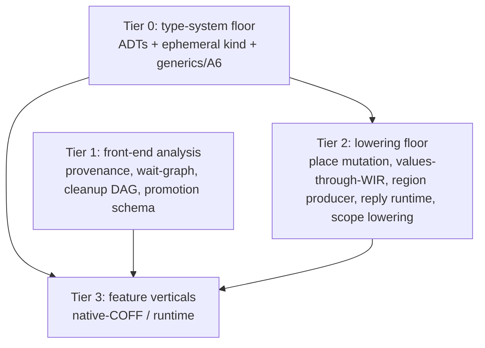

# Unified toolchain execution plan (Lane A + Lane B merged)

**Owner worktree:** `.claude/worktrees/wrela-roadmap-lane-b-ba6e82` (branch
`claude/wrela-roadmap-lane-b-ba6e82`) — now owns the **whole** A+B language +
semantics scope outright (decided 2026-07-21).
**Supersedes:** the "Lane A" vs "Lane B" division in
[`2026-07-20-world-class-roadmap.md`](2026-07-20-world-class-roadmap.md). That
roadmap's task IDs and conformance citations remain valid; only the *lane
grouping and sequencing* are replaced here.
**Detailed B-side briefs + evidence:** kept in
[`2026-07-21-lane-b-execution-plan.md`](2026-07-21-lane-b-execution-plan.md)
(per-task current-state with file:line proof and the B1/B2/B4/B5 re-scopes).
**Ground rules + operating quirks:** §0 and §4 of that Lane B plan apply
verbatim to every task here (no stubs on reachable paths, fail-closed with named
diagnostics, TDD, per-task DoD, label rule, exact-bound recalibration, own
`CARGO_TARGET_DIR`, `xfmt` exit-code trap, late-abort trap). Not repeated here.

---

## 1. Why the lanes merged

Five clean stop-and-report investigations (B1, B2, B4, B5, B5a — no code, no
overclaim) converged on one fact: **the toolchain today only resolves and lowers
scalars and flat aggregates.** Every richer feature in *both* former lanes —
generics, `init`, deriving, collections (was Lane A); views, regions, `iso`,
cleanup, actor replies (was Lane B) — sits behind the *same* missing
infrastructure. "Lane A" and "Lane B" were never separable scopes; they are the
front-ends of one shared build. Verified blocking facts:

- Runtime enum subset admits only `Result[S,S]`-shaped enums: every
  enum-with-args routes to `ensure_core_result_type` (`analyzer.rs:8543`, reject
  `8640`); non-scalar variant payloads rejected (`8927`/`8949`); mixed-arity /
  unit variants rejected (`8892-8901`). No general ADTs.
- No **ephemeral / second-class type kind** exists anywhere (`grep ephemeral`/
  `second_class` → nothing). Views and admission results have no type-kind home.
- No general generics/monomorphization beyond the `Result` special case (A6).
- No `view`/aggregate/reply **value** flows through SemanticWir→FlowWir→
  MachineWir→codegen; the runtime-type gate at `analyzer.rs:8603` fails views
  closed before lowering.
- No **place-level aggregate mutation**: `mut`/`+=`/store on a projected or
  field place is unimplemented (`analyzer.rs:3997`/`7730`); `+=` is scalar-locals
  only.
- Region ops (`Allocate`/`ResetRegion`/`Promote`) and scope ops
  (`EnterScope`/…/`ExitScope`) are validated but **never produced** by any
  lowering stage. `runtime.S` has no scheduler.

---

## 2. The tier model (replaces lane grouping)

Every feature decomposes into slices that land at one of four tiers. A feature is
"done" only when its Tier-3 vertical passes; but most tiers land independently
and green.

- **Tier 0 — Type-system floor (the true base).** Generalize what the compiler
  can *represent*: general ADTs (enums with mixed-arity variants + nominal/
  aggregate payloads), an **ephemeral/second-class type kind**, and generics +
  monomorphization (A6). Gates the widest set — taxonomy, deriving, collections,
  generic containers — and is prerequisite to all lowering of rich values.
- **Tier 1 — Front-end analysis (lands now, parallel, independent of Tier 0).**
  Pure sema/graph/schema slices that introduce **no new runtime value shape**:
  the differentiating diagnostics and reports. This is where Lane B's reason to
  exist actually lives, and it is buildable today.
- **Tier 2 — Lowering floor.** Non-scalar values through the WIR stack + codegen;
  place-level aggregate mutation; the region/escape producer; the reply-slot +
  per-core scheduler runtime; scope-op lowering. Depends on Tier 0 for the value
  shapes it must carry.
- **Tier 3 — Feature verticals.** Each feature's full native-COFF (and, for
  actors/hardware, runtime) vertical, composed from its Tier-1 analysis on top of
  the Tier-0/2 floor. These are the roadmap's original ACs.

Tier 1 does **not** depend on Tier 0 — that is the key scheduling win: the
differentiators land in parallel while the floor is built underneath.

---

## 3. Tier 0 — type-system floor (critical path, build first)

Dependency-ordered. Each is TDD, fail-closed beyond its increment, one commit.

- **T0.1 — General nongeneric ADTs (runtime subset).** Admit enums with
  mixed-arity variants (incl. unit variants) and nominal/aggregate payloads into
  runtime type resolution, replacing the `Result`-only routing at
  `analyzer.rs:8543`. Vertical: define/resolve/`match`/`is` a 3-variant
  mixed-arity enum with a struct payload at the sema tier; lowering stays
  fail-closed with a named `*-lowering-pending` code. **Smallest self-contained
  unblocker** (per B5a: alone makes non-generic `AdmissionResult`/`AdmissionError`
  real). Roadmap tie-in: prerequisite to A3, A5, A8, B5a.
- **T0.2 — Ephemeral / second-class type kind.** Introduce the type-kind with its
  consumption rules (binding/`match`/`is`/`?` legality) and a dedicated
  `?`-rejection path. Unblocks `AdmissionResult` (`match`/`is` only, never `?`)
  and is the home for views (B1) and projection carriers. Depends T0.1.
- **T0.3 — Generics + monomorphization (A6).** Type/const params, inference,
  closed-world monomorphization beyond the `Result` path; generic interfaces with
  bounds; method-call syntax. Largest Tier-0 piece. Roadmap A6. Depends T0.1.

Once T0.1–T0.3 land, **B5a** (outcome taxonomy) becomes landable, as do A5
deriving and A8 collections' type surfaces.

---

## 4. Tier 1 — front-end analysis (in flight now)

These are dispatched or landable immediately; none needs Tier 0.

| Slice | Feature | Status |
|---|---|---|
| B1a | View/projection static semantics (provenance, lexical lifetime, disjointness; named negatives) | **running** |
| B5b | Unified wait-for graph + `wait-cycle`/self-wait diagnostics | **running** |
| B2a | Promotion/region report schema (`PromotionFact`/`RegionAssignmentFact`) | **running** |
| B4a | `with`/scope sema analysis: cleanup DAG + `CleanupAcyclic` + cycle diagnostic | **dispatching** |

Lane A front-ends that are likely Tier 1 (need a surface-verification pass before
dispatch, same as the B tasks got): A2 `for`/closed-iteration *rejection* set,
A7 string/format *diagnostics*, A3 match-completeness *analysis*. Each: verify
whether its positive case introduces a new runtime value shape (→ needs Tier 0)
or is pure analysis (→ Tier 1, land now).

---

## 5. Tier 2 — lowering floor

Dependency-ordered; each depends on the Tier-0 value shapes it carries.

- **L2.1 — Place model + place-level aggregate mutation.** `mut`/`+=`/store on
  field & projected places (`self.field`, `agg.field`). Unblocks view-RMW (B1b),
  actor state, region escape. Overlaps the old "Lane A aggregate ownership".
- **L2.2 — Non-scalar values through WIR + codegen.** Aggregates/views/replies
  represented (or erased) through SemanticWir v8 / FlowWir v10 / MachineWir v10 +
  codecs + LLVM codegen, to native COFF. Depends L2.1, T0.
- **L2.3 — Region/escape producer.** Whole-image escape analysis emitting
  `Allocate`/`ResetRegion`/`Promote`; feeds B2a's schema with real facts (B2b).
- **L2.4 — Reply-slot + per-core scheduler runtime (B5c).** Reply-slot in
  machine-wir + ABI + `ReplyResolve` production + reply-await + `runtime.S`
  per-core scheduler. The actor long pole; gates B6/B8/B9. Per-core only
  (design §5.2) so B9 reuses it unchanged.
- **L2.5 — Scope-op lowering (B4b/B4c).** semantic-lower/flow-lower/machine-lower
  the cleanup DAG on normal then abnormal exit paths.

---

## 6. Tier 3 — feature verticals (the roadmap ACs)

Each composes Tier-1 analysis + Tier-0/2 floor into the original roadmap
vertical: B1b (views→COFF), B2b/B2c (promotion, arena), B3 (`iso` pools), B5c
tail (typed call+reply), B6 (async), B7 (`with request`), B8 (supervision),
B9 (two-core placement), B10 (inferred placement); and Lane A's A1/A3/A4/A5/A7/
A8 native verticals. Sequencing follows the roadmap's dependency map, now gated
by Tier-0/2 availability rather than by lane.

---

## 7. Sequencing

1. **Now (parallel):** finish Tier-1 (B1a, B5b, B2a) + dispatch B4a. Integrate
   each into the branch as it lands (reconcile the shared `analyzer.rs` surface —
   the one real merge cost).
2. **Critical path:** build Tier 0 in order T0.1 → T0.2 → T0.3. Start T0.1 once
   the analyzer-touching Tier-1 agents (B1a, B5b) have integrated, to give T0.1 a
   clean base and avoid a 4-way `analyzer.rs` pileup. T0.3 (generics) is the
   largest single effort and is multi-session.
3. **Then Tier 2** in order L2.1 → L2.2 → (L2.3, L2.4, L2.5 in parallel).
4. **Then Tier 3** feature verticals per roadmap deps; B9 oracled against QEMU
   `-smp 2` until Lane C's C5/C1; B10 (inferred placement) last, spec-ledger edit
   first.

**Cross-lane still-external deps unchanged:** B9 needs Lane C (C5/C1); E-lane and
D2 need this scope substantially complete; B10 needs F5.

---

## 8. Progress

| Tier | Slice | Deps | Status |
|---|---|---|---|
| 1 | B2a promotion/region report schema | — | **landed** 3eb2cb69 |
| 1 | B5b wait-for graph + diagnostics | — | **landed** 3e216d38 |
| 1 | B1a view/provenance semantics | — | not started (never dispatched) |
| 1 | B4a cleanup DAG sema analysis | — | **complete at sema tier** — free-call scope protocols/calls, lexical activations, reverse-source cleanup DAG + `CleanupAcyclic`, synthetic cycle detector, and named await/receiver/outside-`with` rejections; pass-only cleanup bodies and no lowering (`semantic-with-cleanup-lowering-pending`) |
| 0 | **T0.1 general nongeneric ADTs — COMPLETE** | — | **landed** — enum type resolution: unit + mixed-arity + heterogeneous-scalar + flat-struct + nongeneric-enum payloads, tagged-union max-slot layout, structural cycle rejection |
| 0 | · T0.1a unit variants | — | landed ce8385e6 |
| 0 | · T0.1b heterogeneous scalar payloads | T0.1a | landed 4b5f125a |
| 0 | · T0.1c flat-struct payloads | T0.1b | landed c509694d |
| 0 | · T0.1d enum payloads + cycle rejection | T0.1c | landed 0b953537 |
| 0 | T0.1 deferred tails (fail-closed) | T0.1 | nominal/enum **construction** + **lowering**, generic/view/tuple/array payloads, unit-variant DotName construction — all named-diagnostic fail-closed |
| 0 | T0.2 ephemeral type kind | T0.1 + a **producer** | **producer-gated** — needs views (B1) or `try send` (B5c) to exercise the `?`-vs-`match`/`is` rule end to end |
| 0 | T0.3 generics/monomorphization (A6) | T0.1 | queued (multi-session) |
| — | General `match`/`is` over ADTs (consumer; uses T0.1, needed for AdmissionResult consumption) | T0.1 | **complete in A-1** — mixed-arity/per-variant-type exhaustive statement match; unit/payload-wildcard `is`; success-dominated `is` binding remains named fail-closed |
| 2 | L2.1 place-level aggregate mutation | T0 | queued |
| 2 | L2.2 values-through-WIR + codegen | L2.1,T0 | queued |
| 2 | L2.3 region/escape producer | L2.2 | queued |
| 2 | L2.4 reply-slot + scheduler (B5c) | L2.2,T0.1 | queued |
| 2 | L2.5 scope-op lowering (B4b/c) | L2.2,B4a | queued |
| 3 | feature verticals (B1b,B2b/c,B3,B5c,B6–B10,A1/3/4/5/7/8) | tiers 0–2 | queued |

**Sequencing note (2026-07-21):** T0.1 (ADT type resolution) is complete. T0.2
(ephemeral kind) turned out **producer-gated** — the `?`-rejection rule can't be
exercised without a value of an ephemeral type, and the only producers (views,
`try send`) are themselves unbuilt. So the autonomous path pivots to consumers
and producers that are testable now: general `match`/`is` over the new ADTs is
complete at the analysis tier; B1a view analysis (the first ephemeral producer)
is next and unblocks T0.2. Generics (T0.3) and Tier-2 lowering proceed in
parallel as independent tracks.

Update this table and the cited inventory rows as each slice lands. One commit
per slice; the branch is the integration unit for the whole A+B scope.
